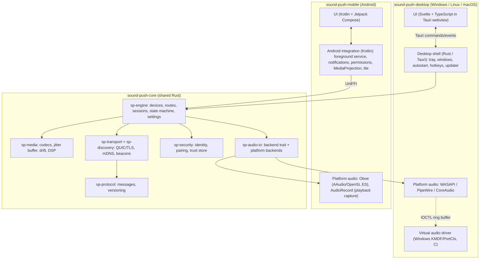
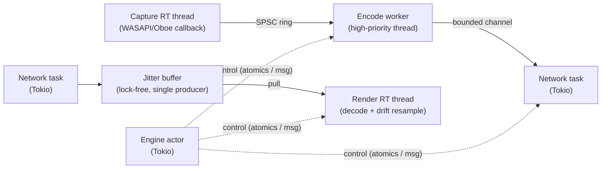
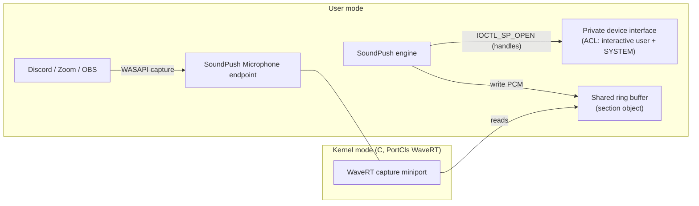
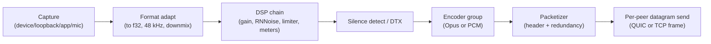
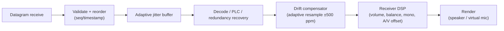
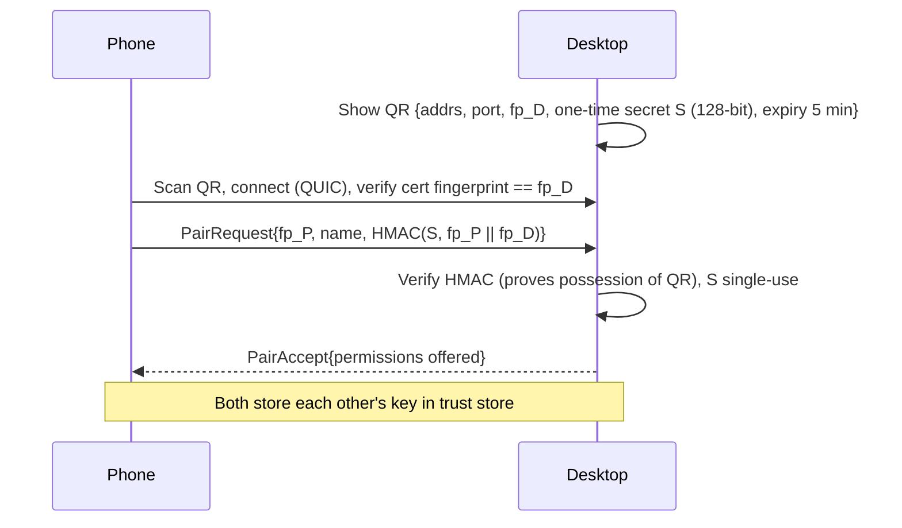
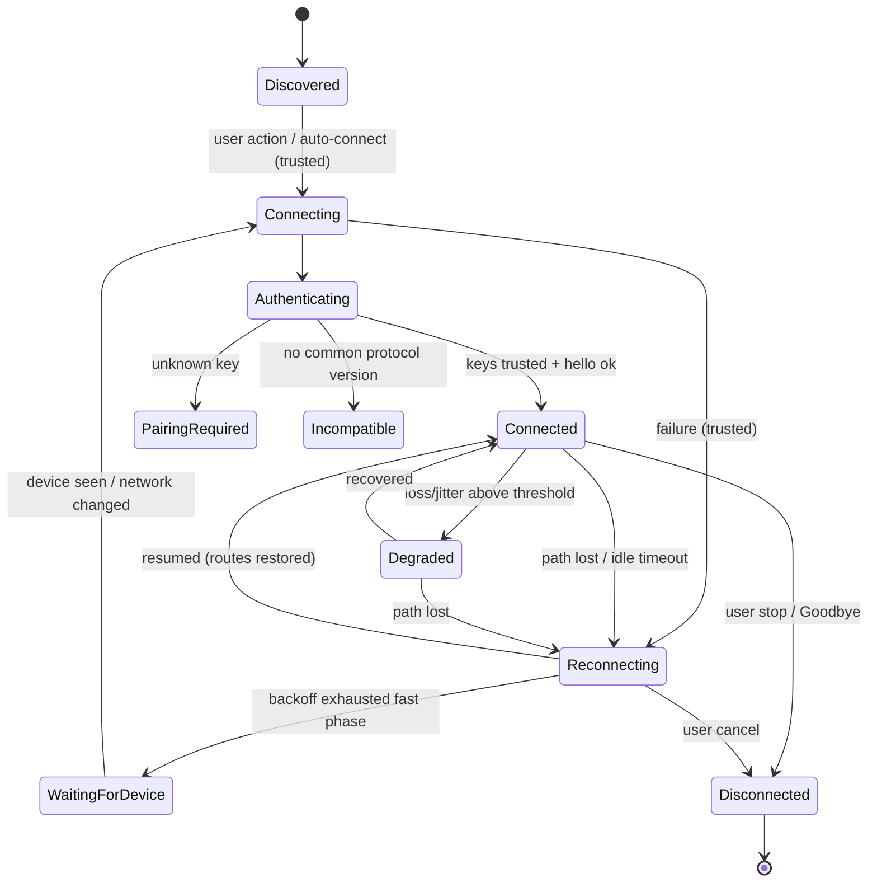

# SoundPush — Final Implementation Plan

> Status: **Approved-for-development baseline** (v1.1 of the plan)
> Date: 2026-09-13
> Inputs: `docs/soundpush-draft.md`, `AudioRelay Competitor/` (website notes, desktop screenshots v0.27.5, Android screen recording v0.26.1), audiorelay.net documentation and FAQ.
> Product model: **100 % free and open source**. No paid tiers, no ads, no feature gating.
> Revision 1.1: open-source model adopted; second AudioRelay parity check added (§4.5, §4.6); macOS moved into the 1.0 release.

---

## Table of Contents

1. [Project Overview](#1-project-overview)
2. [Product Goals and Principles](#2-product-goals-and-principles)
3. [AudioRelay Feature Analysis](#3-audiorelay-feature-analysis)
4. [SoundPush Feature Parity Matrix](#4-soundpush-feature-parity-matrix)
5. [Improvements Over AudioRelay](#5-improvements-over-audiorelay)
6. [AudioRelay Gaps SoundPush Must Address](#6-audiorelay-gaps-soundpush-must-address)
7. [Real-World Use Cases](#7-real-world-use-cases)
8. [Edge Cases and Their Solutions](#8-edge-cases-and-their-solutions)
9. [System Architecture Overview](#9-system-architecture-overview)
10. [Technology Stack and Rationale](#10-technology-stack-and-rationale)
11. [Monorepo Architecture](#11-monorepo-architecture)
12. [Shared Core (Rust) Architecture](#12-shared-core-rust-architecture)
13. [Desktop Architecture](#13-desktop-architecture)
14. [Mobile Architecture](#14-mobile-architecture)
15. [Audio Architecture](#15-audio-architecture)
16. [Networking Architecture](#16-networking-architecture)
17. [Device Discovery Architecture](#17-device-discovery-architecture)
18. [Device Pairing Architecture](#18-device-pairing-architecture)
19. [Connection Management](#19-connection-management)
20. [Reconnection Strategy](#20-reconnection-strategy)
21. [Security Architecture](#21-security-architecture)
22. [Performance Strategy](#22-performance-strategy)
23. [UI/UX Architecture](#23-uiux-architecture)
24. [Desktop Startup and Background Behavior](#24-desktop-startup-and-background-behavior)
25. [Mobile Background Behavior](#25-mobile-background-behavior)
26. [Permissions](#26-permissions)
27. [Error Handling](#27-error-handling)
28. [Logging and Diagnostics](#28-logging-and-diagnostics)
29. [Testing Strategy](#29-testing-strategy)
30. [Code Organization and Development Standards](#30-code-organization-and-development-standards)
31. [Dependency Strategy](#31-dependency-strategy)
32. [Build, Release, and Update Strategy](#32-build-release-and-update-strategy)
33. [Scalability and Future Feature Strategy](#33-scalability-and-future-feature-strategy)
34. [Development Phases](#34-development-phases)
35. [Implementation Priorities](#35-implementation-priorities)
36. [Other Product and Architectural Considerations](#36-other-product-and-architectural-considerations)
37. [Decision Log](#37-decision-log)
38. [Glossary](#38-glossary)

---

## 1. Project Overview

**SoundPush** is a wireless (and wired) audio-routing system between computers and phones. It lets a user:

- Hear their **PC audio on their phone** (phone as wireless speaker/headphones).
- Use their **phone's microphone as a PC microphone** that any app (Discord, Zoom, Teams, OBS, games) can select.
- Send **phone app audio to a PC** or to another phone.
- Send a **PC microphone to a phone or another PC**.
- Use a phone as a **full wireless headset** (PC audio + phone mic in one session).
- Stream to **multiple devices** at once.

It is built as a monorepo containing:

- `sound-push-desktop` — Windows (primary), Linux, and macOS application.
- `sound-push-mobile` — Android application (iOS prepared for, not in the first release).
- `sound-push-core` — a shared Rust engine (protocol, security, transport, audio DSP, session logic) used by both apps.

The direct competitor and reference product is **AudioRelay** (desktop v0.27.5, Android v0.26.1). SoundPush covers everything important AudioRelay does, then fixes its security, reliability, setup, and UX gaps.

SoundPush is **completely free and open source**. Every feature is available to everyone. There are no paid plans, subscriptions, ads, or time limits.

---

## 2. Product Goals and Principles

### 2.1 Goals

| Goal | Measurable target |
|---|---|
| Fast connection | Paired device connects in **< 1.5 s** on LAN from tap to audio. First-time pairing in **< 30 s** with QR. |
| Low latency | End-to-end (capture → speaker) **≤ 40 ms USB**, **≤ 60 ms Wi-Fi "Balanced"**, **≤ 35 ms Wi-Fi "Low latency"** on a good 5 GHz network. |
| Long-running stability | 24-hour soak with **zero** unrecoverable disconnects and **no latency creep** (drift-compensated). |
| Recovery | Automatic recovery from Wi-Fi drop/roam within **≤ 3 s** after the network returns. |
| Low resource usage (desktop) | Idle in tray: **< 0.5 % CPU, < 40 MB RAM** (UI window closed). One active Opus stream: **< 3 % of one core**. |
| Low resource usage (mobile) | Receiving Opus 128 kb/s over Wi-Fi: target **≤ 6 %/hour battery** on a mid-range device (screen off). |
| Secure by default | No unpaired device can receive audio or a microphone from a user's device. All traffic is encrypted and authenticated. |
| Simple | The three core tasks (speaker, mic, headset) each take **≤ 2 actions** from the home screen once paired. |
| Accessible | WCAG 2.1 AA; full screen-reader and keyboard operation on every platform. |

### 2.2 Product principles

1. **Powerful functionality + simple UX + clean architecture.** Advanced options exist, but they are never on the first screen.
2. **Task language, not network jargon.** Users choose "Use phone as microphone", not "Server → Microphone source" + "Player → Mode: Mic".
3. **Safe defaults, automatic fixes.** If a known problem can be detected (wrong audio format, blocked firewall, Bluetooth latency), SoundPush detects it and offers a one-tap fix instead of a FAQ link.
4. **One engine, many shells.** Protocol, crypto, jitter buffering, and session logic are written once in Rust. UI and OS integration are native per platform.
5. **Nothing silent about the microphone.** Every active mic stream is always visible (notification, tray indicator, OS privacy indicator).
6. **Free and open, forever.** Fully open source, no paid tiers, no ads, no telemetry. Diagnostics stay local, and the user decides whether to share them.
7. **Minimal, modern, clean.** Few screens, one clear primary action per screen, calm visuals, and Light / Dark / System themes on both apps (§23.4). No decoration and no UI over-engineering.

---

## 3. AudioRelay Feature Analysis

This section documents everything observed in the provided materials, so no hidden feature is missed.

### 3.1 What AudioRelay is

A client/server audio streaming app. Each device can act as a **Server** (sends audio) or a **Player** (receives audio). Transport is IP over Wi-Fi or USB tethering. Compression is Opus. Platforms: Windows, Linux, macOS, and Android (Android is the only mobile client).

### 3.2 How AudioRelay works (inferred from UI and docs)

- **Discovery:** Players list "Servers" found automatically on the LAN (Android v0.26.1 added "automatically search for servers"). Manual fallback is "Connect by address" (IP or hostname).
- **Transport:** A fixed listening port (**59100**, per the `BIND_SOCKET_ERROR` error-code doc). The FAQ says audio stays on the local network. The UI and docs never mention pairing, authentication, or encryption.
- **Speaker (PC → phone):** The desktop captures an output device (WASAPI loopback on Windows) and streams it. The desktop "Audio device" picker selects which output device to capture (the screenshot shows "Virtual Speakers (Virtua…)").
- **Microphone (phone → PC):** The phone runs the "Microphone" source. The PC Player uses "Mode: Mic" and writes into a **virtual audio device** ("Virtual Mic for AudioRelay" on Windows 10+). Windows 7 needs VB-CABLE. Linux needs manual `pactl` null-sink + remap-source commands.
- **App audio (phone → PC/phone):** The Android "Apps" source uses Android 10+ playback capture. Some apps block capture.
- **Latency control:** A receiver-side buffer (Low/Medium/High/Custom), a choice of output API (OpenSL ES vs AudioTrack), and live latency statistics.

### 3.3 Desktop application (v0.27.5) — complete inventory

**Navigation:** left sidebar with `Server`, `Player`, `Settings`.

**Server tab** ("Send audio from this device to another")
- Explainer card with two capabilities, **Send audio** (audio played on this computer) and **Send mic input** (a connected mic), plus an `INSTRUCTIONS` external link. The card can be dismissed (✕).
- **Device card:** device name (`RAKIB`) and local IP (`192.168.68.103`).
- **Audio device card:** "Select which audio device to stream" (for example "Virtual Speakers").
- **Connections list:** "No connected device yet" when empty.

**Player tab** ("Receive the audio of another device")
- Explainer card: **Receive audio** (listen on this computer) and **Receive mic input** (use another device as mic; *"A virtual audio device is necessary"*), plus `INSTRUCTIONS`.
- **Connect by address:** IP address or hostname field and a `CONNECT` button.
- **Servers list:** discovered servers ("No server found").
- **Mode:** `Mic` (use your phone's mic) or `Playback` (listen to another device).

**Settings**
- *Display:* Device name (shown to other devices), Dark theme toggle, **Minimize window** (minimize instead of closing), Language.
- *Startup:* Launch AudioRelay on computer startup.
- *Advanced:* **Enable EventSync** (improves capture latency; disable if audio issues), **Enable continuous audio capture** (prevents glitches after silence).
- *Help:* Instructions, FAQ, Forum, Email links; **Logs** (path plus `OPEN` button).
- *About:* Version, **Update** check button, **Error reporting** toggle (on by default), Translations, Privacy policy, Translators, Open-source licenses.
- **Stream to multiple devices** (locked: "Connect a mobile device with premium to unlock").

### 3.4 Android application (v0.26.1) — complete inventory

**Global:** app bar with a connection status subtitle ("Connected"); top tabs `Player`, `Server`, `Settings`; an ad banner or "Remove ads — Support development" footer.

**Player tab**
- **Active connection card:** server name, IP, session timer (`06:02`), `MUTE PC`, `STOP`.
- **Contextual tip card:** "Audio output — Changing the output could help solve volume or quality issues" with `DISMISS` and `CHANGE`.
- **Stats card:** Buffer (for example 80 ms); Latency Average (0.9–1.2 ms) and Max (10–26 ms).
- **Max latency graph:** live chart with 10 ms and 50 ms guide lines.
- **Player settings:**
  - **Audio quality:** `Uncompressed` ("requires a good connection") or `Compressed`. Compression bitrates: 10 kb/s (VoIP), 24/32/64/96 kb/s (talks, audiobooks, podcasts), 128/256/450 kb/s (music, movies, games). Everything except the defaults is ★ premium.
  - **Audio output:** `OpenSL ES` (low latency, with an "Enable audio effects" option that may improve quality but adds latency) or `AudioTrack` (standard). Note: "In order to use an equalizer, select AudioTrack and disable the low latency request".
  - **Buffer amount:** `Low` (movies, games; needs a good connection), `Medium`, `High` (music; buffers before playing), `Custom` ★ premium. A forum bug report says the custom value resets to 120 ms when set below about 105 ms.
  - **Exclusive audio:** `Activated` (stop when another app plays), `Deactivated` (mix with other apps), `Deactivated (Play during phone calls)` (not guaranteed on every device).
  - **Handle audio device disconnections:** stop when a headset or Bluetooth device disconnects (toggle).
  - **Media style notification:** notification appearance, which allows changing the output device (toggle).
- **Servers list** (discovered PCs), **Connect by address**, and a **USB tethering** card ("Reduce delays and audio artifacts…", a manufacturer note, and a `SETTINGS` shortcut).

**Server tab**
- **Sources:** `Microphone` (stream your mic) or `Apps` (stream the sound of your apps).
- **Running server card:** device model name (Xiaomi Redmi Note 9 Pro), IP, source icon, running timer, stop button.
- **Connections list.**
- **Premium upsell card:** no time limit, stream to multiple devices, and more.
- **Microphone settings:**
  - *App audio effects:* **Volume boost** toggle with a **Gain slider 0–20 dB** (clipping warning); **Noise suppression (RNNoise)** ★ premium (CPU warning).
  - **Microphone mode:** `Default`, `Voice communication` (echo cancellation + volume normalization), `Raw` (unprocessed), `Voice performance` (low latency), `Voice recognition`, `Camcorder`, `Mic` (alternate).
  - *System audio effects* (device-provided): **Automatic gain control** (greyed out: "Effect not available on this device"), **Noise suppression**, **Echo cancellation**.

**Settings tab**
- **Premium** (connect multiple devices, remove ads) with `PREMIUM UPGRADE`.
- *Device:* Device name.
- *Display:* **Theme** (`Auto`, `Dark`, `Light`), **Language** (system language plus Arabic, Chinese (China/Taiwan), English, French, German, Hungarian, Indonesian, and more).
- *Setup:* **Server download** (share sheet to send the PC download link), FAQ, Forum, Contact us, **USB tethering** (add a shortcut in the app, toggle).
- *About:* Share app, Play Store feedback, Translations, **Usage and error reports** (on by default), Translators, Open-source licenses, Privacy policy, Version.

**Premium screen**
- Plans: Monthly (BDT 90, 7-day trial, auto-renew) and Lifetime (BDT 1,000).
- *Player mode:* multiple devices, notification controls (stop/resume), audio quality settings, custom buffer settings.
- *Server mode:* multiple devices, **unlimited connection time** (the free mic has a time limit), mic noise suppression.
- Remove ads, Support AudioRelay, subscription notes, `Restore purchases`, `Subscribe`.

### 3.5 Website and documentation

- Marketing: Mic for PC, Speaker for PC, Wireless, USB ("best experience"), Multiple devices ("multiple rooms, multiple people"), Low delay ("lower latency than Bluetooth").
- Docs: Windows (send audio, phone as mic, Windows 7 variant, missing audio device, Media Feature Pack), Linux (send audio, phone as mic via PulseAudio modules), macOS (virtual audio device needed), Android (send phone audio to a PC or phone, Android 10+), USB tethering, casting PC audio to Google Home through the phone's Bluetooth.
- FAQ: multi-device premium unlock lasts until server restart; OEM background killing (links dontkillmyapp.com); quality fixes (AudioTrack, 48 kHz on Windows); Bluetooth latency is inherent; reduce latency (OpenSL ES, Low/Custom buffer 30–50 ms); low volume depends on PC volume; audio focus; CPU spikes with multichannel output (switch to stereo); "app constantly reconnects" (update both sides); "no sound" (disable EventSync); white screen on startup.
- Error codes: *Connection down/blocking* (network/firewall); *Child process exited with code 1* on startup (GPU driver / software rendering, which points to a Chromium-based desktop shell); *COMException 0x88890008* (unsupported device audio format, audio enhancement or overlay apps); *Socket error 10013 / BIND_SOCKET_ERROR* (port 59100 unavailable).

---

## 4. SoundPush Feature Parity Matrix

Legend: ✅ parity · ⬆ parity + improved · 🆕 new in SoundPush · 🔒 AudioRelay premium feature, free for everyone in SoundPush (see §36.1)

### 4.1 Streaming capabilities

| AudioRelay capability | SoundPush | Notes |
|---|---|---|
| PC system audio → phone | ⬆ | Plus per-app capture on Windows 10 2004+, and "mute PC while streaming" without losing stream volume. |
| PC mic → another device | ✅ | Any input device. |
| Phone mic → PC (virtual mic) | ⬆ | Single "SoundPush Microphone" device installed on demand; no manual sink/source setup on Linux. |
| Phone app audio → PC / phone (Android 10+) | ⬆ | Clear per-app capture-blocked explanation. |
| PC receives audio (desktop Player) | ✅ | |
| PC receives mic input | ⬆ | Routes straight into the virtual mic. |
| Phone ↔ phone | ✅ | |
| Multiple receivers 🔒 | ⬆ | Free; encoder sharing for efficiency; synchronized multi-room later (§33). |
| Wi-Fi | ⬆ | Encrypted QUIC with connection migration. |
| USB tethering | ✅ | |
| — | 🆕 | **USB via ADB reverse** (no tethering, no mobile-data risk). |
| — | 🆕 | **Headset mode** (PC audio + phone mic in one action, echo-cancelled). |
| — | 🆕 | Mobile hotspot / Wi-Fi Direct-friendly (works on any IP link). |

### 4.2 Connection and devices

| AudioRelay | SoundPush | Notes |
|---|---|---|
| Automatic server discovery | ⬆ | mDNS/DNS-SD plus broadcast fallback plus last-known-address probing. |
| Connect by IP/hostname | ✅ | Kept under "Add device manually". |
| Device name setting | ✅ | |
| Connections list | ⬆ | Per-device status, quality, route, and quick actions. |
| — | 🆕 | **Secure pairing** (QR or 6-digit code), trusted-device list, per-device permissions, revoke. |
| — | 🆕 | Auto-connect to trusted devices; favourite and default routes. |
| — | 🆕 | Remote route control (start "use phone mic" from the PC, subject to consent). |

### 4.3 Audio settings

| AudioRelay | SoundPush | Notes |
|---|---|---|
| Uncompressed / Compressed | ✅ | "Lossless (PCM)" and "Opus". |
| Opus 10–450 kb/s 🔒 | ⬆ | Presets (Voice / Standard / High / Max), **Auto** adaptive bitrate, and a **Custom bitrate** picker (6–510 kb/s, including AudioRelay's exact steps). |
| OpenSL ES / AudioTrack output | ⬆ | Oboe automatically picks AAudio or OpenSL ES; "Compatibility output" (AudioTrack) toggle for EQ/effects; auto-fallback on failure. |
| Buffer Low/Medium/High/Custom 🔒 | ⬆ | **Latency profile**: Low latency / Balanced / Stable / Custom, with an adaptive jitter buffer inside the chosen bounds and no 120 ms custom floor bug. |
| Exclusive audio (3 modes) | ⬆ | Pause / Duck / Mix, "keep playing during calls", and **auto-resume after interruption**. |
| Handle audio device disconnections | ✅ | Pause on headset/Bluetooth disconnect (default on). |
| Media style notification | ⬆ | Always has Stop/Mute controls (free) plus output-device switcher. |
| Notification stop/resume 🔒 | ⬆ | Free. Also a Quick Settings tile and home widget. |
| Mute PC | ⬆ | "Mute PC speakers" that keeps the stream at full level, available on the PC and remotely from the phone. |
| Volume boost + 0–20 dB gain | ✅ | Plus a live level meter. |
| RNNoise 🔒 | ⬆ | Free; can run on phone **or** PC (user picks where CPU is spent). |
| Mic modes (7 Android input presets) | ✅ | Same presets, clearer names, "Recommended" badge. |
| System AGC / NS / AEC (availability-aware) | ✅ | |
| EventSync / continuous capture (desktop advanced) | ⬆ | Handled automatically by the capture engine; kept only as hidden troubleshooting overrides. |
| Desktop audio device selection | ⬆ | "Follow system default" option with hot-swap on device change. |
| — | 🆕 | Per-stream receiver volume, balance, and stereo→mono (single-earbud use). |
| — | 🆕 | Push-to-talk / mic mute global hotkey on desktop. |
| — | 🆕 | Latency/A-V sync offset adjustment; Bluetooth output latency warning. |

### 4.4 App, settings, and support

| AudioRelay | SoundPush | Notes |
|---|---|---|
| Stats (buffer, avg/max latency, graph) | ⬆ | Quality badge on home; full "Connection details" panel on both desktop and mobile. |
| Theme Auto/Dark/Light | ⬆ | **System (default) / Light / Dark on both apps**, switching live when the OS theme changes (AudioRelay's desktop app only had a Dark toggle). |
| Language / translations | ✅ | Community translations; RTL support. |
| Launch on startup | ⬆ | Start minimized to tray, optional auto-resume of the last routes, detects "disabled in Task Manager". |
| Minimize instead of close | ⬆ | Close-to-tray is the default, with an explicit Quit in the tray. |
| Update check | ⬆ | Signed auto-update with release notes. |
| Error reporting (default on) | ⬆ | No automatic reporting. Crash reports stay local; the user can preview them and attach them to an issue. |
| Logs folder | ⬆ | "Export diagnostics bundle" plus an in-app network test. |
| FAQ / Forum / Email / Instructions links | ⬆ | In-app **guided troubleshooter** first, links second. |
| Server download share link | ✅ | "Get SoundPush for PC" share link / QR. |
| USB tethering shortcut | ⬆ | Unified USB guide (tethering or ADB) with detection. |
| Share app, store feedback, translators, OSS licenses, privacy policy, version | ✅ | |
| Premium/subscription, restore purchases | — | Not applicable. SoundPush is fully free and open source (§36.1), and every AudioRelay premium feature is included for everyone. |

### 4.5 Platform parity

| Platform | AudioRelay | SoundPush 1.0 |
|---|---|---|
| Windows 10 / 11 | ✅ | ✅ primary platform |
| Windows 7 / 8.1 | ✅ (Windows 7 mic through VB-CABLE) | ❌ intentional: these systems no longer get security updates. Documented on the download page. |
| Linux | ✅ | ✅ (PipeWire, with a PulseAudio fallback) |
| macOS (Apple Silicon + Intel) | ✅ | ✅ **in 1.0** (Phase 4), with a native virtual microphone |
| Android | 5.0+ (app audio needs 10+) | 8.0+ (API 26), app audio 10+. Intentional: Android 5–7 are a very small share of active devices and lack AAudio and modern foreground-service support. |
| iOS | ❌ | Future (§33), already prepared for in the architecture |

### 4.6 Parity re-audit additions (revision 1.1)

A second screen-by-screen pass over every AudioRelay screenshot, recording frame, store listing, and doc page found these items that v1.0 of the plan did not state explicitly. They are now required for 1.0.

| AudioRelay item | Where seen | SoundPush requirement |
|---|---|---|
| Session duration timer on the active connection (e.g. `06:02`) | Android Player and Server cards | Every route card on both apps shows elapsed streaming time |
| "Mute PC" button on the phone | Android Player card | Remote "Mute PC speakers" action on the phone route card, sent as a control message |
| Remote volume control | Store listing | Two-way `VolumeSet` control: the sender can adjust the receiver's stream volume, and the receiver can adjust its own |
| Real-time mic monitoring ("monitor input in real time") | Store listing | "Listen to my mic" monitoring toggle on phone and PC over a low-latency local path, with a headphone recommendation and a feedback warning |
| OpenSL ES "Enable audio effects" (better quality, more latency) | Android Audio output screen | "Output audio effects" toggle under Advanced output (turns off the low-latency path so the device's own effects apply) |
| Exact Opus bitrate steps 10/24/32/64/96/128/256/450 kb/s | Android Audio quality screen | Custom bitrate picker includes these values (§4.3) |
| Dismissible explainer and tip cards (Server/Player explainer with Instructions; "Changing the output could help…") | Desktop and Android | Contextual tip banners with Dismiss (remembered per tip) and a direct fix action |
| Windows N/KN editions missing the Media Feature Pack | Windows docs | Detect the missing Media Feature Pack at startup; guide the user to Settings → Optional features; the engine avoids depending on Media Foundation where possible |
| No speakers / missing audio device on PC | Windows docs ("Missing audio device") | The "SoundPush Speakers" virtual endpoint can be the capture target; the troubleshooter detects when there is no playback device |
| Desktop receives audio or mic; desktop sends mic | Desktop Server/Player cards | Covered in §4.1; listed here to confirm the audit |
| Server download share link; USB tethering shortcut toggle | Android Settings | Covered in §4.4 |
| Language list with a "System language" default (Arabic, Chinese, Hungarian, Indonesian, …) | Android Language screen | "System language" default, community translations (Weblate), RTL layouts |
| Cast PC audio to a Google Home through the phone's Bluetooth | Docs usage page | Supported flow (U7) with Bluetooth latency detection and a suggestion to use the Stable profile |

---

## 5. Improvements Over AudioRelay

Grouped by the goals in the draft.

### 5.1 Functionality
- **Headset mode:** a phone used as a full-duplex wireless headset in one session, with acoustic echo cancellation.
- **Per-app capture on Windows** (Windows 10 2004+ process loopback): stream only a game or browser, or everything *except* the call app.
- **Mixed source:** system audio + mic in one stream (for example, a commentary feed to another device).
- **ADB USB mode** with no tethering, plus a USB auto-detect hint.
- **Remote route control:** start or stop any route from either device.
- **Push-to-talk / toggle-mute global hotkey** for the virtual mic.
- **Per-device profiles:** each trusted device remembers its own quality, latency profile, and volume.
- **Stereo→mono**, balance, and per-stream volume on the receiver.
- **Test tools:** test tone, mic loopback test, level meters.

### 5.2 Reliability
- **Clock-drift compensation** (adaptive resampling), so latency does not creep over hours.
- **Adaptive jitter buffer** inside user-chosen bounds, instead of a static buffer.
- **Session resume tokens** and QUIC connection migration for Wi-Fi roams and IP changes.
- **Device hot-swap** on the desktop (default device change, device unplugged).
- **Dynamic port fallback**, so a busy port never breaks the app (fixes AudioRelay's BIND_SOCKET_ERROR).
- **Automatic format conversion** for any device format and channel count (fixes COMException 0x88890008 and multichannel CPU spikes).
- **Supervisor restarts** of a failed audio pipeline without restarting the app.
- **Auto-resume after phone calls and transient audio-focus loss.**

### 5.3 Security
- Mandatory **pairing** plus **mutual authentication** plus **encryption** (TLS 1.3 via QUIC). AudioRelay exposes streams without any visible pairing.
- **Per-device permissions** (may receive my audio / may use my mic / may control me).
- Microphone never streamed to an unpaired device; persistent mic indicator.
- "Only allow connections on private networks" default on the desktop.
- **No telemetry at all.**

### 5.4 Performance
- Native Rust engine with a lock-free real-time audio path. The desktop UI webview is **destroyed** when the window closes, so tray mode is lightweight.
- Opus encoder sharing across receivers with identical settings.
- Silence-aware transmission (DTX) that keeps the timeline (no "continuous capture" toggle needed).
- Wi-Fi low-latency lock and Wi-Fi voice-queue (DSCP) marking where the OS allows it.

### 5.5 UI/UX
- Task-first home screen (Speaker / Microphone / Headset) instead of Server/Player/Mode jargon.
- QR pairing instead of typing IP addresses.
- One screen per task; advanced settings behind "Advanced" disclosure.
- Contextual, actionable problem banners ("Your phone's audio is going to Bluetooth, which adds about 150 ms of delay. [Switch to phone speaker]").
- Quick Settings tile, home widget, tray menu with active routes.
- Consistent design system and design tokens across desktop and mobile.

### 5.6 Accessibility
- WCAG 2.1 AA, TalkBack/Narrator/NVDA/Orca labels. AudioRelay is listed by blind-user software directories, so screen-reader users are a real audience.
- Full keyboard navigation, visible focus, font scaling to 200 %, reduced motion, high-contrast mode, RTL layouts.
- No information conveyed by color alone (quality badges use icon + text).

### 5.7 Setup
- The Windows virtual microphone is installed **together with SoundPush** by the same installer. Stage 1 is bundled VB-CABLE; stage 2 is our own signed "SoundPush Microphone" driver (§10.7). There is no separate install and one restart prompt.
- The macOS virtual microphone ("SoundPush Microphone", our own AudioServerPlugIn) is embedded in the app and installed with one click.
- Linux virtual microphone is created **automatically** through PipeWire (PulseAudio fallback). No terminal commands.
- Firewall rule created at install (private networks); a network profile problem gets a guided fix.

---

## 6. AudioRelay Gaps SoundPush Must Address

| # | AudioRelay gap / weakness (evidence) | Impact | SoundPush solution |
|---|---|---|---|
| G1 | No visible pairing, authentication, or encryption; open fixed port 59100 | Anyone on the same Wi-Fi (café, dorm, office) could potentially connect to a running mic server | Pairing + mutual TLS + per-device permissions (§18, §21) |
| G2 | Server/Player/Mode jargon; mic setup spans 3 screens on 2 devices plus OS sound settings | High setup failure rate | Task-based flows; one-tap "Use phone as microphone" starts both ends (§23) |
| G3 | Linux mic requires manual `pactl` modules; Windows 7 requires VB-CABLE; macOS requires a third-party virtual device | Non-technical users blocked | Automatic PipeWire node; Windows virtual mic installed with SoundPush (bundled VB-CABLE, then our own signed driver); built-in macOS HAL plug-in |
| G4 | FAQ "app tries to constantly reconnect", "no sound → disable EventSync" | Fragile sessions; users must toggle internals | Explicit connection state machine, version negotiation, capture auto-fallback (§19, §20) |
| G5 | Background killing on OEM ROMs; FAQ only links dontkillmyapp | Streams stop on Xiaomi/Samsung/etc. | Correct foreground-service types, battery-optimization exemption guidance per OEM, Wi-Fi lock, watchdog (§25) |
| G6 | Custom buffer resets to 120 ms below about 105 ms (forum bug) | Users cannot reach low latency | Validated latency bounds; adaptive buffer; drift compensation (§15) |
| G7 | Static port 59100 binding failures (error 10013) | App unusable when the port is taken | Preferred port + automatic fallback, advertised via discovery/QR (§16) |
| G8 | COMException 0x88890008 (device format); multichannel CPU spikes | Capture fails or is costly | Format-agnostic capture with efficient downmix/resample (§15) |
| G9 | Startup white screen / "child process exited" (Chromium-style shell crash, GPU drivers) | App does not open | Engine independent of UI; the tray works even if the webview fails; software-render fallback (§13) |
| G10 | Free mic time limit, paid multi-device, ads with financial promotions | Poor trust and UX | Fully free and open source: no ads, no limits, no paid tiers (§36.1) |
| G11 | Error reporting and usage data **on by default** | Privacy | No telemetry; diagnostics stay local |
| G12 | No headset (duplex) mode, per-app capture, push-to-talk, or per-stream volume | Missing real-world workflows | §5.1 |
| G13 | Multi-device unlock lasts only until server restart | Confusing | No entitlements at all; multi-device is always available |
| G14 | Bluetooth latency only explained in the FAQ | Users blame the app | Detect the BT route, show the measured added latency, offer a switch (§8) |
| G15 | Diagnostics = open logs folder | Hard support | Diagnostics bundle, network self-test, in-app troubleshooter (§28) |
| G16 | Premium gating on audio quality and custom buffer | Core quality locked | All quality controls free |
| G17 | No iOS client, no native macOS virtual device | Platform coverage | macOS with a native virtual mic in 1.0 (Phase 4); iOS prepared for (§33) |
| G18 | No auto-resume of streams after PC/phone restart | Re-setup every day | Trusted auto-connect + "resume last routes" (§20, §24) |
| G19 | Desktop exposes no live stats | Hard to tune from the PC | Connection details on both ends |
| G20 | Separate "USB tethering" shortcut toggles and data-usage caveats | Confusing; possible mobile data charges | ADB mode; detection and warning when tethering would route PC internet via mobile data |

---

## 7. Real-World Use Cases

| # | Persona / scenario | Route(s) | Key requirements |
|---|---|---|---|
| U1 | Remote worker whose PC has no mic joins Teams/Zoom | Phone mic → PC virtual mic | Echo cancellation, noise suppression, stable for multi-hour calls, push-to-mute |
| U2 | Gamer on Discord with a PC mic hotkey | Phone mic → PC | Low latency, global push-to-talk, auto-reconnect after game crash |
| U3 | Late-night movie without disturbing others, PC has no Bluetooth | PC audio → phone + wired earphones | Latency ≤ 60 ms (lip sync), mute PC speakers, A/V offset |
| U4 | Wireless headset for a PC | PC audio → phone + phone mic → PC (Headset mode) | Duplex, AEC, single action |
| U5 | Multi-room music party | PC audio → 3 phones / speakers | Multi-device; optional synchronization later |
| U6 | Streamer/podcaster: phone as a second camera mic in OBS | Phone mic (Raw) → PC | Unprocessed audio, high quality PCM, stable clocks |
| U7 | Listening to PC audio from another room over a phone-connected Bluetooth speaker (the Google Home doc case) | PC audio → phone → BT speaker | BT latency warning, High-stability profile |
| U8 | Sending phone game or music audio into a PC for recording or streaming | Phone apps → PC | Android 10+ capture; blocked-app explanation |
| U9 | Accessibility: a blind user sets up everything with a screen reader | Any | Fully labelled flows, keyboard pairing (6-digit code), audio cues |
| U10 | Office/café Wi-Fi with client isolation | Any | USB (ADB/tethering) or hotspot guidance; clear detection |
| U11 | Home PC auto-starts; phone connects every evening | PC → phone | Autostart, trusted auto-connect, tray-only |
| U12 | Phone as a baby monitor / room mic to a PC | Phone mic → PC speakers | Hours-long, screen-off, battery-aware, mic indicator |
| U13 | Linux laptop user (PipeWire) using a phone mic | Phone mic → Linux | Automatic virtual source |
| U14 | Classroom/presenter using a phone as a roaming mic into PC speakers | Phone mic → PC output device | Low latency, feedback warning when routed to speakers |
| U15 | Two PCs: laptop audio to desktop speakers | PC → PC | Desktop receive support |
| U16 | Language interpreter listening to a PC feed in one ear | PC → phone mono | Stereo→mono, per-stream volume |

---

## 8. Edge Cases and Their Solutions

### 8.1 Network

| Edge case | Solution |
|---|---|
| Wi-Fi drops briefly | Receiver enters `Reconnecting`, plays PLC, then fades to silence. QUIC idle timeout 10 s with keepalives every 1 s. Resume token restores the route without renegotiation. |
| Phone roams to another AP or switches 2.4↔5 GHz (IP may change) | QUIC connection migration on the client; server validates the new path. If migration fails, reconnect via device-ID rediscovery. |
| PC IP changes (DHCP renewal) | mDNS re-announcement; client resolves by **device ID**, not IP; last-known IPs are only hints. |
| Network changes to a different SSID where the peer is absent | State `Waiting for device` (not an error). Background probing backs off to 30 s and wakes immediately on OS network-change events. |
| Router blocks multicast (no mDNS) | UDP broadcast beacon fallback; last-known-address unicast probing; QR contains addresses. |
| Client/AP isolation (guest networks) | Diagnostic: discovery sees nothing **and** direct probe fails while both have internet → "This network blocks devices from talking to each other" with USB/hotspot options. |
| VPN active on PC or phone | Bind sockets to LAN interfaces; advertise only LAN interfaces; detect a VPN interface capturing all routes and warn ("Your VPN may block local devices; enable 'Allow LAN' in VPN settings"). |
| Multiple NICs (Ethernet + Wi-Fi + Hyper-V/WSL/Docker virtual adapters) | Advertise all candidate addresses ordered by priority (physical Ethernet > Wi-Fi > others); exclude known virtual adapters; client races candidates (happy-eyeballs style, 250 ms stagger). |
| IPv6-only or link-local networks | Support IPv4 and IPv6; link-local with scope IDs. |
| Poor Wi-Fi (loss, jitter) | Adaptive jitter buffer grows within profile bounds; Auto bitrate lowers Opus bitrate; optional redundancy (§15.6); UI quality badge shows "Poor" with suggestions. |
| Congested network / bandwidth cap | Opus Auto profile targets ≤ 2× measured headroom; PCM auto-downgrades to Opus 256 kb/s if loss > 2 % sustained (with notice). |
| Port already in use | Try preferred port, then a random ephemeral port; advertise the actual port; never fatal. |
| Windows firewall blocks / network set to "Public" | Installer adds an app-scoped rule for Private networks; detect a Public profile and offer "Treat this network as private" guidance or a one-time allow (elevated). |
| Hotspot from the phone to the PC | Works as an ordinary IP network; phone-hotspot gateway detection for better addressing. |
| USB tethering routes PC internet through mobile data | Detect tethering interface is default route; warn about data usage; recommend ADB mode. |
| ADB not authorized / no developer mode | Guided steps; detect `unauthorized` state; fallback to tethering or Wi-Fi. |
| Extremely long sessions (days) | Drift compensation; periodic key update (TLS KeyUpdate) handled by QUIC; counters use 64-bit; memory stays bounded (no growing histories). |
| Clock jumps (NTP adjust, sleep) | Media timing uses monotonic clocks only. |

### 8.2 Devices, sessions, and user mistakes

| Edge case | Solution |
|---|---|
| Duplicate connection from the same device (app restarted, old session lingering) | New authenticated session with the same device ID **supersedes** the old one immediately; the old one is closed with reason `Superseded`. |
| Two devices try to connect simultaneously in both directions | Deterministic tie-break: lower device-ID initiates; the other side's attempt is cancelled. |
| User taps Connect repeatedly | Connection attempts are idempotent per peer; the UI button becomes a cancelable progress state. |
| Two routes want the same virtual mic | Only one active feed per virtual mic; a second request prompts "Replace current microphone source?" |
| Mic routed to the same PC's speakers (feedback loop) | Detect route `mic → local speakers` while the phone is in the same room (echo correlation); warn and suggest headphones or Headset mode (AEC). |
| Streaming PC audio **to itself** or loops (A→B→A) | Route graph validation rejects cycles; loopback capture excludes SoundPush's own playback process (process-exclude loopback). |
| Peer is on an incompatible protocol version | Version negotiation; clear "Update SoundPush on *Device*" message with a share-link action. |
| Device renamed | Trust is bound to the key, not the name; the name updates everywhere. |
| Phone factory reset / app reinstalled (new identity key) | Appears as a new unpaired device; the old entry is shown as "not seen for N days" with "Remove". No silent trust transfer. |
| Paired device lost/stolen | "Remove device" revokes the key immediately; active sessions are terminated. |
| Unknown device attempts to connect repeatedly | Rate-limited; pairing requests require local user action; "Block" option. |
| Invalid manual address | Validate input format; resolve the hostname with a timeout; specific errors ("No SoundPush found at 192.168.1.20 — check it's open on that device"). |
| Settings changed during streaming (bitrate, profile) | Applied live via control messages; codec reconfiguration at frame boundaries without reconnecting. |
| Corrupted settings file | Atomic writes; on parse failure keep a `.bak`, restore defaults, and show a notice. |

### 8.3 Audio

| Edge case | Solution |
|---|---|
| Windows default output device changes (headphones plugged in) | `IMMNotificationClient` → if "Follow system default", seamlessly reopen the capture on the new device (≤ 200 ms gap, crossfade). |
| Captured device removed | Fall back to the system default with a notice; auto-return when the device reappears (if pinned). |
| Device format unsupported / exotic (7.1, 24-bit, 192 kHz) | Shared-mode capture in the mix format; engine resamples to 48 kHz and downmixes to stereo with SIMD. |
| Exclusive-mode app grabs the device | Detect `AUDCLNT_E_DEVICE_IN_USE`; show "Another app is using this device exclusively". |
| Audio enhancements / overlay apps (Nahimic, Sonic Studio) break capture | Detect known failure HRESULTs; try alternative capture init; troubleshooter mentions detected overlay services. |
| Silence for long periods (no audio playing) | Timeline continues; DTX packets; no re-sync glitch on resume. |
| PC sleep/hibernate while streaming | On resume: rebuild audio clients, reconnect sessions. Optional "Prevent sleep while streaming" (`SetThreadExecutionState`). |
| Receiver output switches to Bluetooth | Measure output latency via `AudioTrack/AAudio` timestamps; show the added latency; offer "Compensate A/V offset" or "Switch output". |
| Headset unplugged on phone | `ACTION_AUDIO_BECOMING_NOISY` → pause (default) to avoid blasting the speaker. |
| Phone call / other app takes audio focus | Profile: Pause (auto-resume after call), Duck, or Mix. Mic source: Android silences mic capture during calls. Show "Paused during call" and resume after. |
| Another app starts recording the mic on Android 10+ (shared capture) | Detect silenced capture via `AudioRecordingConfiguration` callbacks; show "Microphone in use by another app". |
| Virtual mic selected but no route active | Driver outputs silence; tray shows "SoundPush Microphone idle". Optional "Start phone mic when an app opens the SoundPush Microphone" (driver notifies engine of stream open). |
| Virtual mic driver not installed / blocked (Secure Boot, policy, S-mode) | Detect; one-click reinstall from the Audio page (Windows: bundled VB-CABLE setup; macOS: SoundPush Microphone). Any existing virtual cable (Voicemeeter, BlackHole) is also detected. A real speaker is never used as a virtual mic. |
| Clipping from volume boost | Soft limiter after gain; clip indicator in the level meter. |
| Sample-rate mismatch between devices | Always 48 kHz on the wire; resample at the edges. |
| CPU starvation (games at 100 % CPU) | MMCSS "Pro Audio" priority; RNNoise auto-disables with notice if deadline misses exceed a threshold. |

### 8.4 Application lifecycle and platform

| Edge case | Solution |
|---|---|
| Desktop app crash | Crash handler writes a local report that is offered for export on the next launch. If "Resume last routes" is on, relaunch restores sessions. The Windows installer registers restart via `RegisterApplicationRestart`. |
| Audio pipeline thread panic | Supervisor restarts that pipeline; the session continues; incident logged. |
| Windows restart | Autostart (HKCU Run) → tray → trusted peers auto-connect → resume last routes if enabled. |
| Autostart disabled by user in Task Manager | Detect `StartupApproved` state; the settings toggle shows "Disabled in Task Manager" with an explanation. |
| Phone restart | Android 15+ forbids starting microphone/mediaPlayback/mediaProjection foreground services from `BOOT_COMPLETED`. So post a notification "Tap to reconnect to *PC*" and provide a Quick Settings tile. Never pretend to auto-start what the OS forbids. |
| App killed by OEM battery manager | Foreground service with correct type; one-time OEM-specific battery exemption guide (Xiaomi autostart, Samsung "never sleeping apps", etc.); watchdog detects unexpected process death and posts a resume notification. |
| PC requests phone mic while the phone app is in background | Android forbids starting a microphone FGS from background. Phone shows a heads-up notification "*PC* wants to use this phone's microphone — Allow". If a mic FGS is already running, the route starts immediately. |
| MediaProjection consent revoked or per-session (Android 14+) | Every app-audio session requests consent; when stopped by the system (the user taps "Stop sharing" in the status bar), the route ends gracefully with a notice. |
| Low memory on phone | No large buffers; release the codec on stop; `onTrimMemory` drops caches. |
| Multiple users on one Windows PC (fast user switching) | Per-user engine instance; the driver is shared, but IOCTL access is limited to the active console session's engine. |
| Unsupported OS (Windows 7/8, Android < 8) | Installer/store blocks with an explanation; web page lists alternatives. |
| Running two instances of the desktop app | Single-instance lock (named mutex / lock file); a second launch focuses the existing window. |

---

## 9. System Architecture Overview

### 9.1 Layered view



### 9.2 Core idea: devices, endpoints, routes

The system is **peer-to-peer and symmetric**. There is no fixed "server" or "player". Every SoundPush node advertises **capabilities**:

- **Sources:** `system_audio`, `app_audio(filter)`, `microphone(input_id)`, `mixed(...)`
- **Sinks:** `speaker(output_id)`, `virtual_mic`, `virtual_line` (future), `file_recorder` (future)

A **Route** = `(source endpoint on device A) → (sink endpoint on device B) + StreamProfile`.
A **Session** = one authenticated connection between two devices, carrying 0..N routes (Headset mode = 2 routes in one session).

This model replaces AudioRelay's Server/Player/Mode matrix, and new sources or sinks can be added without architectural change.

---

## 10. Technology Stack and Rationale

### 10.1 Summary

| Layer | Choice | Version policy |
|---|---|---|
| Shared engine | **Rust** (stable, edition 2024) | Pinned toolchain via `rust-toolchain.toml`, updated quarterly |
| Transport | **QUIC** via `quinn` + `rustls` (TLS 1.3), with **TLS-over-TCP** fallback | |
| Codec | **Opus** (libopus via `audiopus`/`opus` bindings), **PCM** s16/f32 | |
| DSP | `rubato` (resampling), `nnnoiseless` (RNNoise port), in-house jitter buffer, limiter, meters | |
| Discovery | `mdns-sd` (desktop), Android `NsdManager` bridged through the engine, custom UDP beacon | |
| Serialization | **Protocol Buffers** via `prost` for control; fixed binary header for media | |
| Desktop shell | **Tauri 2** (Rust) | |
| Desktop UI | **Svelte 5 + TypeScript + Vite** | |
| Windows audio | `windows` crate (WASAPI, MMDevice, process loopback, MMCSS) | |
| Windows virtual audio driver | **C (KMDF + PortCls WaveRT miniport)** based on Microsoft SysVAD sample | |
| Linux audio | `pipewire` crate (PipeWire ≥ 0.3.48), `libpulse-binding` fallback | |
| macOS audio | CoreAudio + process taps (macOS 14.4+; ScreenCaptureKit audio as fallback on macOS 13), AudioServerPlugIn virtual device (C++) | Minimum macOS 13 |
| Android app | **Kotlin + Jetpack Compose (Material 3)** | minSdk 26, targetSdk latest |
| Android audio | **Oboe** (via Rust `oboe` bindings) for mic/speaker; Kotlin `AudioRecord` for playback capture | |
| Android ↔ Rust | **UniFFI** generated Kotlin bindings; built with `cargo-ndk` | |
| Build | Cargo workspace, pnpm workspace (desktop UI), Gradle (Android), **just** as task runner | |
| CI | GitHub Actions (Windows, Ubuntu, macOS runners; Android emulator) | |

### 10.2 Why a shared Rust core

- **One implementation of the hard parts.** Protocol parsing, crypto handshake, pairing, jitter buffer, drift compensation, and the reconnection state machine are identical on both ends. Divergent implementations are the top cause of "constantly reconnecting" class bugs (G4).
- **Memory safety for network-facing code.** Every packet parser faces untrusted LAN input. Rust removes use-after-free and buffer-overflow classes without a GC pause in the audio path.
- **Real-time friendly.** No GC; deterministic allocation control; lock-free ring buffers (`rtrb`).
- **Portable to future platforms.** iOS (Swift via UniFFI), macOS, and a headless Linux daemon reuse the same crates.
- **Mature ecosystem** for exactly what we need: `quinn`, `rustls`, `tokio`, `windows`, `pipewire`, `oboe`, `uniffi`.

### 10.3 Why Tauri 2 + Svelte for the desktop UI (and what we rejected)

| Option | Verdict | Reason |
|---|---|---|
| **Tauri 2 + Svelte** | ✅ Chosen | Rust backend in-process with the engine (no IPC layer to maintain); system webview (WebView2 on Windows) → installer ~10–15 MB vs AudioRelay ~68 MB; built-in tray, autostart, updater, single-instance plugins; **the webview can be destroyed when the window closes** so tray mode costs almost nothing; mature web accessibility; fast UI iteration. Svelte compiles to small vanilla JS with minimal runtime. |
| Electron | ❌ | 150–250 MB RAM baseline and a bundled Chromium. AudioRelay's white-screen and GPU child-process startup failures (G9) are this class of problem. |
| Qt / C++ | ❌ | Strong, but C++ memory-safety risk in network code, commercial licensing considerations, slower UI iteration. |
| .NET / WPF / WinUI | ❌ | Windows-only; Linux is a requirement. |
| Pure-Rust native GUI (egui, Slint, iced) | ❌ for now | Lower resource use, but accessibility (screen readers, IME, RTL) is less mature than web, and AA accessibility is a hard requirement. Revisit in the future; the UI is a thin layer, so a later swap is cheap. |
| Flutter desktop | ❌ | Audio/network code would still be native via FFI; adds a Dart runtime without solving tray/driver needs. |

**Mitigation for webview risk:** the engine and tray run without the webview. If the webview fails to initialize (missing or broken WebView2), streaming and tray controls still work, and the app offers WebView2 repair or install.

### 10.4 Why native Kotlin + Compose for Android (and what we rejected)

| Option | Verdict | Reason |
|---|---|---|
| **Kotlin + Compose + Rust core** | ✅ Chosen | Direct access to foreground-service types, MediaProjection, audio focus, `NsdManager`, Quick Settings tiles, widgets, and OEM quirks. Compose is Google's long-term UI toolkit with first-class TalkBack support. The audio hot path stays native (Rust/Oboe) with no bridge per buffer. |
| Flutter | ❌ | Audio capture/playback, services, and MediaProjection would all be platform-channel plugins; two languages anyway; the bridge adds latency and complexity in exactly the part that matters. |
| React Native | ❌ | Same issues as Flutter, plus JS thread jank. |
| Kotlin Multiplatform (shared Kotlin with desktop) | ❌ | The desktop engine is Rust for performance and driver integration; KMP would duplicate the engine. KMP remains an option for sharing *UI state* with a future iOS app, but UniFFI already covers the core. |

### 10.5 Why QUIC

- **Encrypted and authenticated by design** (TLS 1.3, mandatory).
- **Unreliable datagrams (RFC 9221)** for audio and **reliable streams** for control, on **one UDP port and one handshake**.
- **Connection migration**: sessions survive Wi-Fi roams and IP changes (a core edge case).
- **0-RTT/fast resumption** for quick reconnect.
- Built-in keep-alive, idle timeout, and congestion signals we use for adaptive bitrate.
- **Fallback:** TLS 1.3 over TCP with length-prefixed frames. Required because `adb reverse` only forwards TCP, and some networks block UDP. Both implement the same `Transport` trait.

### 10.6 Why Opus + PCM

- Opus is the best low-delay general-purpose codec (2.5–60 ms frames, 6–510 kb/s, `RESTRICTED_LOWDELAY` CELT mode ≈ 5 ms algorithmic delay) and royalty-free. AudioRelay also uses it, so there is parity in quality expectations.
- PCM (lossless) for USB/LAN users who want zero coding artifacts (48 kHz stereo 16-bit ≈ 1.54 Mb/s).
- FLAC/other codecs: not initially needed; the codec is behind a `Codec` trait (§33).

### 10.7 Windows virtual microphone: bundled VB-CABLE first, own signed driver next

**Constraint.** Windows loads kernel audio drivers only when Microsoft-signed. Attestation signing needs
an EV code-signing certificate, which the project does not have yet. AudioRelay's own "Virtual Mic for
AudioRelay" is Microsoft-signed; no free route exists (see `docs/virtual-microphone.md` §4).

**Stage 1: VB-CABLE bundled in the SoundPush installer (now).**
- Packaging: the NSIS installer carries the official VB-CABLE package, downloaded from vb-audio.com in CI
  and never committed.
- Install flow: VB-CABLE installs silently (`VBCABLE_Setup_x64.exe -i -h`) in the same elevated step, and
  the installer asks for one restart at the end, as VB-CABLE requires. The step is skipped if VB-CABLE is
  already present. Uninstalling SoundPush leaves VB-CABLE in place, since other apps may use it.
- Licence: VB-Audio's donationware licence permits bundling. The installer and Audio page show "VB-CABLE by
  VB-Audio. VB-CABLE is a donationware, all participations are welcome". Only standard VB-CABLE (not
  A+B / C+D) is bundled. Obtain VB-Audio's written confirmation before public release.
- Engine: no change. It already feeds "CABLE Input"; apps select "CABLE Output". The Audio page shows the
  exact name to pick and offers "Reinstall virtual microphone".

**Stage 2: our own "SoundPush Microphone" driver (developed in parallel, shipped once signed).**
- Driver: exposes **one** capture endpoint "SoundPush Microphone" (plus optional "SoundPush Speakers"
  render endpoint), fed by the engine.
- Language: C on the Microsoft SysVAD/WaveRT model, because audio miniport drivers in Rust
  (`windows-drivers-rs`) are not yet mature for PortCls. Kept deliberately tiny (~2–3k LOC), with Static
  Driver Verifier, Driver Verifier, and IOCTL fuzzing.
- Source and CI: lives in `sound-push-desktop/drivers/windows-virtual-audio/`, built and test-signed in
  GitHub Actions. Developers test it with `bcdedit /set testsigning on`.
- Release: after **Microsoft attestation signing** (EV certificate + Partner Center), the installer ships this
  driver instead of VB-CABLE.
- Detection: the engine prefers "SoundPush Microphone" over "CABLE Input", so there is always one virtual
  microphone in use.

---

## 11. Monorepo Architecture

### 11.1 Structure

```
soundpush/
├── README.md
├── LICENSE                          # GPL-3.0-or-later (ADR-0014)
├── CONTRIBUTING.md
├── CODE_OF_CONDUCT.md
├── SECURITY.md                      # private vulnerability reporting policy
├── justfile                         # task runner entry points (build, test, lint, release)
├── Cargo.toml                       # Rust workspace (core crates + desktop shell)
├── rust-toolchain.toml
├── deny.toml                        # cargo-deny: licenses, advisories, duplicate deps
├── .github/
│   ├── workflows/                   # ci-core.yml, ci-desktop.yml, ci-mobile.yml, release.yml
│   └── CODEOWNERS
├── docs/
│   ├── soundpush-draft.md
│   ├── soundpush-final.md           # this plan
│   ├── adr/                         # Architecture Decision Records (0001-rust-core.md …)
│   ├── protocol/                    # wire protocol spec, versioning rules
│   ├── security/                    # threat model, pairing spec
│   └── ux/                          # flows, copy guidelines
├── sound-push-core/                 # shared Rust engine
│   ├── sp-protocol/
│   ├── sp-security/
│   ├── sp-transport/
│   ├── sp-discovery/
│   ├── sp-media/
│   ├── sp-audio-io/
│   ├── sp-engine/
│   ├── sp-ffi/                      # UniFFI bindings (mobile; future iOS)
│   └── sp-testkit/                  # network simulator, audio fixtures, fake backends
├── sound-push-desktop/
│   ├── src-tauri/                   # Rust shell crate (tray, windows, commands, autostart, updater)
│   │   ├── src/
│   │   │   ├── main.rs
│   │   │   ├── commands/            # thin wrappers over sp-engine API
│   │   │   ├── tray/
│   │   │   ├── platform/            # windows/, linux/, macos/ integration (startup, hotkeys, firewall)
│   │   │   └── driver_bridge/       # virtual mic install + IOCTL client (Windows)
│   │   ├── capabilities/            # Tauri permission capabilities (least privilege)
│   │   └── tauri.conf.json
│   ├── ui/                          # Svelte + TypeScript frontend
│   │   ├── src/
│   │   │   ├── app/                 # routing, layout, shell
│   │   │   ├── features/            # home, devices, pairing, audio, settings, diagnostics, onboarding
│   │   │   ├── lib/engine/          # typed client for commands/events (generated types)
│   │   │   ├── lib/components/      # design-system components
│   │   │   └── i18n/
│   │   └── package.json
│   ├── drivers/
│   │   ├── windows-virtual-audio/   # C KMDF/PortCls driver, INF, test tools
│   │   └── macos-virtual-audio/     # C++ AudioServerPlugIn (HAL) virtual microphone
│   └── packaging/                   # NSIS, deb/rpm/AppImage/Flatpak, DMG/Homebrew, signing scripts
├── sound-push-mobile/
│   ├── android/
│   │   ├── settings.gradle.kts
│   │   ├── gradle/libs.versions.toml
│   │   ├── app/                     # application module (DI container, navigation, manifest)
│   │   ├── core-engine/             # UniFFI-generated bindings + native .so packaging + Kotlin facade
│   │   ├── core-ui/                 # design system (theme from tokens, components)
│   │   ├── feature-home/
│   │   ├── feature-devices/         # discovery, pairing (QR scan), device detail
│   │   ├── feature-audio/           # player/mic settings
│   │   ├── feature-settings/
│   │   ├── feature-diagnostics/
│   │   └── platform-service/        # foreground service, notifications, tile, widget, MediaProjection
│   └── ios/                         # placeholder README only (future)
├── design/
│   ├── tokens/                      # colors, typography, spacing, radii, motion (JSON, W3C token format)
│   └── scripts/                     # generate CSS variables + Compose theme from tokens
└── tools/
    ├── netsim/                      # tc/netem profiles, Windows clumsy presets
    ├── latency-probe/               # end-to-end latency measurement (chirp + cross-correlation)
    └── soak/                        # long-running automated test harness
```

### 11.2 Rules

- **Dependency direction:** apps → `sp-engine` → lower crates. Lower crates never depend on apps or the engine. Enforced with `cargo-deny` bans plus a CI check script.
- **Share only real value:** protocol, security, media, and session logic are shared. UI, OS services, and permissions are native per platform. No cross-platform UI sharing.
- **Independent builds and tests:** `just core-test`, `just desktop-dev`, `just mobile-build` each work alone. Android CI downloads prebuilt core `.so` artifacts when core is unchanged (path filters).
- **Design tokens are the only UI sharing:** one source → CSS variables (desktop) and a Compose `Theme` (Android), so both platforms stay visually consistent.
- **ADRs** record every significant decision (§37 seeds the first ones).
- **Adding a new app** (for example `sound-push-ios`, `sound-push-cli`) = a new top-level folder that depends on `sp-engine`/`sp-ffi`; no restructuring.

---

## 12. Shared Core (Rust) Architecture

### 12.1 Crates and responsibilities

| Crate | Responsibility | Key types |
|---|---|---|
| `sp-protocol` | Protobuf control messages, media packet header codec, protocol version negotiation, capability bits. Pure, no I/O. | `ControlMsg`, `MediaHeader`, `ProtocolVersion`, `Capabilities` |
| `sp-security` | Device identity (Ed25519), certificate generation, fingerprinting, pairing protocol, SAS code derivation, trust store (encrypted at rest), permission model. | `DeviceIdentity`, `DeviceId`, `TrustStore`, `PairingSession`, `Permission` |
| `sp-transport` | `Transport` trait; QUIC implementation (quinn); TLS-over-TCP implementation; pinned-certificate verifier; datagram/stream abstraction; path stats (RTT, loss). | `Transport`, `Connection`, `MediaChannel`, `ControlChannel`, `PathStats` |
| `sp-discovery` | mDNS/DNS-SD advertise and browse, UDP beacon, last-known-address probe, candidate address ranking. Platform hooks for Android `NsdManager`. | `Discovery`, `PeerAdvert`, `Candidate` |
| `sp-media` | Codec trait (Opus, PCM), packetizer, adaptive jitter buffer, drift estimator + resampler, PLC, redundancy, DTX, gain/limiter, RNNoise, meters, mixer/downmix. No OS calls. | `Codec`, `JitterBuffer`, `DriftCompensator`, `Pipeline`, `DspChain` |
| `sp-audio-io` | `AudioBackend` trait (enumerate, open input/output/loopback, device-change events) + implementations behind cargo features: `wasapi`, `pipewire`, `pulse`, `coreaudio`, `oboe`, and `null` (tests). Real-time thread setup. | `AudioBackend`, `DeviceInfo`, `CaptureStream`, `RenderStream` |
| `sp-engine` | The product brain: device registry, route manager, session manager, connection state machines, reconnection policy, settings store + migrations, event bus, diagnostics collector. **The only public API used by apps.** | `Engine`, `EngineHandle`, `EngineEvent`, `RouteSpec`, `Settings` |
| `sp-ffi` | UniFFI interface definitions exposing `EngineHandle` to Kotlin (and Swift later); callback interfaces for events and platform hooks (NSD, playback-capture PCM feed). | `uniffi::export` wrappers |
| `sp-testkit` | Simulated transport with loss/jitter/reorder/duplication/migration; fake audio backends generating chirps/sines; latency measurement helpers; golden audio comparisons. | `SimNetwork`, `FakeBackend` |

### 12.2 Engine API shape (abridged)

```rust
pub struct EngineHandle { /* Arc to actor */ }

impl EngineHandle {
    pub async fn start(config: EngineConfig, platform: Arc<dyn PlatformHooks>) -> Result<Self, EngineError>;
    pub fn subscribe(&self) -> EventStream;              // EngineEvent: state snapshots + notices

    // Devices & pairing
    pub async fn begin_pairing(&self, method: PairingMethod) -> Result<PairingTicket, EngineError>;
    pub async fn confirm_pairing(&self, ticket: PairingTicketId, accept: bool) -> Result<(), EngineError>;
    pub async fn set_permissions(&self, device: DeviceId, perms: Permissions) -> Result<(), EngineError>;
    pub async fn forget_device(&self, device: DeviceId) -> Result<(), EngineError>;
    pub async fn connect_manual(&self, address: String) -> Result<DeviceId, EngineError>;

    // Routes
    pub async fn start_route(&self, spec: RouteSpec) -> Result<RouteId, EngineError>;
    pub async fn update_route(&self, id: RouteId, profile: StreamProfile) -> Result<(), EngineError>;
    pub async fn stop_route(&self, id: RouteId) -> Result<(), EngineError>;

    // Settings & diagnostics
    pub async fn update_settings(&self, patch: SettingsPatch) -> Result<Settings, EngineError>;
    pub async fn run_network_test(&self, device: DeviceId) -> Result<NetworkReport, EngineError>;
    pub async fn export_diagnostics(&self, dest: PathBuf) -> Result<PathBuf, EngineError>;
}
```

- **Actor model:** the engine runs as a Tokio task owning all mutable state; commands arrive through an mpsc channel. No shared-mutable-state locking across modules.
- **State snapshots:** the UI renders `EngineState` (immutable snapshot, versioned) delivered on change and throttled for stats (4 Hz). UIs contain **no business logic**.
- **Real-time audio threads are outside Tokio:** dedicated OS threads (MMCSS/AAudio callback) connected to network tasks by lock-free SPSC ring buffers.

### 12.3 Threading model



Rules for RT threads: no allocation, no locks, no syscalls except the audio API, no logging (counters only; flushed by a non-RT thread).

---

## 13. Desktop Architecture

### 13.1 Application architecture

- **Single process**, single instance (`tauri-plugin-single-instance`).
- **Engine** (`sp-engine`) starts first, before any window. **Tray** starts second. **Main window** is created only when requested (user opens it, first run, or onboarding). Closing the window **destroys the webview** (configurable "Keep window in memory for instant reopen" is off by default).
- **Commands layer** (`src-tauri/src/commands`) contains thin, typed wrappers around `EngineHandle`. TypeScript types are generated from Rust (`specta`/`tauri-specta`) so the UI and engine never drift.
- **Events:** engine snapshots are forwarded to the webview only while a window exists.

### 13.2 Core desktop modules

| Module | Location | Responsibility |
|---|---|---|
| Tray | `src-tauri/src/tray` | Active routes, per-route mute/stop, mic mute toggle, quick connect to recent devices, open window, quit. Status icon states: idle / streaming / mic live (red dot) / problem. |
| Windowing | `src-tauri/src/main.rs`, `main_window.rs` | Create/destroy window; every open shows it in the normal state at the default size, centered and fitted to the work area (maximizing lasts only while it is open); start minimized. |
| Autostart | `platform/*/startup.rs` | Windows: HKCU `Run` value with `--autostart`; Linux: XDG `~/.config/autostart/soundpush.desktop`; macOS: `SMAppService` login item. Detect external disablement. |
| Hotkeys | `platform/*/hotkeys.rs` | Global push-to-talk / toggle-mute, configurable; conflict detection. |
| Power | `platform/windows/power.rs` | Sleep/resume notifications (`WM_POWERBROADCAST`), optional prevent-sleep while streaming. |
| Network integration | `platform/windows/network.rs` | Network change notifications (`NotifyIpInterfaceChange`), network category (Public/Private) detection, firewall rule check/repair (elevated helper). |
| Driver bridge | `driver_bridge/` | Detect, install (elevated `pnputil` helper with UAC), upgrade, and uninstall the virtual audio driver; open the device interface; map the shared ring buffer; health checks. |
| Updater | Tauri updater plugin | Signed update manifests; check on startup (throttled daily) and on demand. |
| Crash handling | `src-tauri/src/crash.rs` | Panic hook + minidump (`minidumper`/`crash-handler`), stored locally; offered for export on the next launch (no upload service). |

### 13.3 Desktop audio input/output handling

**Windows (primary):**
- **System audio capture:** WASAPI loopback on the selected render endpoint (shared mode, event-driven) or **process loopback** (`AUDIOCLIENT_ACTIVATION_TYPE_PROCESS_LOOPBACK`) for include/exclude-app capture (Windows 10 2004 / build 19041+). SoundPush's own process is always excluded to prevent loops.
- **"Mute PC speakers while streaming":** preferred approach routes system playback to the **SoundPush Speakers** virtual endpoint (made temporary default, previous default restored on stop/crash-recovery) and captures from it. This gives full-level capture with silent physical speakers. Fallback: capture the physical device and mute its endpoint volume where the driver keeps loopback unaffected. Phase 0 spike validates loopback-vs-endpoint-mute behavior per device class.
- **Mic capture:** WASAPI shared-mode capture on any input device.
- **Playback (desktop as receiver):** WASAPI shared-mode render, event-driven, low-latency buffer (`IAudioClient3` minimum period when available).
- **Virtual mic sink:** writes frames into the driver ring buffer (shared memory section + event handles), 48 kHz stereo/mono float.
- **Thread priority:** `AvSetMmThreadCharacteristics("Pro Audio")`.
- **Device changes:** `IMMNotificationClient` → engine event → pipeline reopen with crossfade.

**Linux:**
- PipeWire: capture from monitor ports (system audio) or per-application nodes (per-app capture comes naturally), mic capture from sources, playback to sinks.
- **Virtual mic:** the engine creates an `Audio/Source` node named "SoundPush Microphone" through PipeWire (visible to Discord/Zoom via pipewire-pulse). It is removed when the engine exits. No `pactl` commands.
- PulseAudio-only systems: automatically load `module-null-sink` + `module-remap-source` via libpulse on demand and unload on exit.

**macOS (Phase 4, part of 1.0):**
- Capture: CoreAudio process taps (macOS 14.4+) for system and per-app audio; ScreenCaptureKit audio capture as the fallback on macOS 13.
- Virtual mic: an AudioServerPlugIn HAL driver ("SoundPush Microphone") running in user space, notarized, no kext.
- System integration: menu-bar item instead of a tray; login item via `SMAppService`.
- Minimum version: macOS 13.

### 13.4 Windows virtual audio driver design



- Endpoints: **SoundPush Microphone** (capture, 48 kHz, 1–2 ch) and optional **SoundPush Speakers** (render) for the mute-PC feature.
- The ring buffer is mapped once; there are no per-frame IOCTLs. Underruns produce silence (never garbage).
- The IOCTL surface is minimal (open, close, format query, stats). Every input is length- and range-validated.
- The driver notifies the engine when a client app opens or closes the mic stream (enables "auto-start phone mic when the SoundPush Microphone is used").
- Signed via attestation signing; INF with `PnpLockdown=1`; tested with Driver Verifier, SDV, and an IOCTL fuzzer.

### 13.5 Background operation

- Normal state: tray icon + engine; discovery advertises; trusted peers may connect.
- Idle optimization: when no routes are active for 60 s, audio backends are closed and only the network/discovery tasks remain (0 wakeups/s beyond keepalives).
- The window is optional at every point; every core action is available from the tray.

### 13.6 Desktop permissions and system integration

- Windows mic privacy settings (`Settings → Privacy → Microphone → Desktop apps`) are detected. If denied, show a deep link `ms-settings:privacy-microphone`.
- Firewall: the installer registers an inbound rule for `SoundPush.exe` on Private profiles (UDP/TCP). A runtime check offers repair through the elevated helper.
- Elevation is used **only** for driver install/uninstall and firewall repair, via a separate, signed, minimal helper executable invoked with UAC, never by running the main app elevated.

### 13.7 Desktop error handling, logging, testing, and updates

Covered in §27–§32 with desktop specifics: Windows Event Log is not used (noisy); logs go to `%LOCALAPPDATA%\SoundPush\logs`; the updater uses Tauri's minisign-signed manifests; tests include WASAPI backend integration tests on Windows CI runners with the virtual driver installed in test-signing mode.

### 13.8 Desktop future extensibility

New sources, sinks, codecs, and transports plug into core traits. Desktop-specific extensions (Stream Deck plugin, CLI, OBS plugin) connect to the engine through a future **local API** (see §33.3) without touching the UI.

---

## 14. Mobile Architecture

### 14.1 Application architecture (Android)

- **Single-activity** app, Compose Navigation, **unidirectional data flow**: `Engine (Rust) → EngineRepository (Kotlin, StateFlow) → ViewModel → Compose UI`. User intents go back through ViewModel → repository → engine command.
- **Manual dependency injection** via an `AppContainer` (the app is small; Hilt adds build time and complexity without clear benefit). Revisit if module count grows past about 15.
- **Modules** (§11.1): `app`, `core-engine`, `core-ui`, `feature-*`, `platform-service`. Feature modules depend on `core-engine` + `core-ui` only; features never depend on each other.
- **Settings:** stored by the **Rust engine** (single source of truth, shared schema with desktop). Only Android-only UI preferences (e.g., dismissed tips) use Jetpack DataStore.

### 14.2 UI architecture

- Material 3 Compose using the SoundPush theme generated from design tokens. Light / Dark / System (default) with live switching. No dynamic (wallpaper) color, so both apps look identical.
- Screens: Home, Devices (list, detail, pair), Route setup sheets, Audio settings, Settings, Diagnostics, Onboarding.
- Adaptive layouts for tablets and foldables (list-detail on wide screens).
- All text in `strings.xml`, plurals, RTL mirrored icons where appropriate.

### 14.3 Mobile audio architecture

| Function | Implementation |
|---|---|
| Receive/playback (phone as speaker) | Rust `oboe` output stream: performance mode LowLatency, usage Media, sharing Exclusive → fallback Shared; AAudio on 27+, OpenSL ES on 26. Decode + jitter buffer + drift resampler run in the callback path (bounded, allocation-free). |
| Compatibility output | Optional AudioTrack path (Kotlin) for devices with broken low-latency paths or when the user wants system EQ (parity with AudioRelay's AudioTrack option). Auto-suggested if glitches are detected on the fast path. |
| Output audio effects (parity) | Advanced toggle that turns off the low-latency fast path so the device's own audio effects apply (better quality on some devices, more latency). |
| Mic monitoring (parity) | Low-latency local monitor of the processed mic, for wired or Bluetooth headphones. |
| Mic capture | Rust `oboe` input stream with `InputPreset` = Generic / VoiceCommunication / Unprocessed / VoicePerformance / VoiceRecognition / Camcorder (mapped to AudioRelay's 7 modes; "Mic (alternate)" = Generic with a different audio source fallback). System effects (`AcousticEchoCanceler`, `NoiseSuppressor`, `AutomaticGainControl`) attached by session ID, with availability detection. |
| App audio capture | Kotlin `AudioRecord` with `AudioPlaybackCaptureConfiguration` (MediaProjection) on Android 10+; a reader thread pushes 10 ms frames into the Rust pipeline via a zero-copy direct `ByteBuffer`. |
| Audio focus | `AudioFocusRequest` per profile (Pause / Duck / Mix), `OnAudioFocusChangeListener` → engine route pause/resume; auto-resume after transient loss. |
| Output route awareness | `AudioDeviceCallback` detects Bluetooth/wired/speaker changes; output latency measured via timestamps; BT warning. |
| Noisy intent | `ACTION_AUDIO_BECOMING_NOISY` → pause if enabled. |

### 14.4 Mobile networking, discovery, pairing, and connections

- Networking is entirely in Rust (`sp-transport`), with sockets created in the app process.
- Android-specific hooks via `PlatformHooks` callback interface:
  - `NsdManager` for mDNS browse/advertise (more reliable on Android than raw multicast; requires `WifiManager.MulticastLock` only during active scanning).
  - `ConnectivityManager.NetworkCallback` → engine `network_changed()` for immediate reconnection.
  - `WifiManager.WifiLock` (`WIFI_MODE_FULL_LOW_LATENCY` on API 29+, `HIGH_PERF` below) held only while streaming.
- **Pairing:** QR scanning with CameraX + **ZXing** (Apache-2.0, fully open source, so F-Droid builds contain no proprietary Google libraries); manual 6-digit code as the no-camera alternative.

### 14.5 Background operation

See §25. Summary: one `StreamingService` (foreground service) whose declared types change dynamically with active routes (`mediaPlayback`, `microphone`, `mediaProjection`). The engine lives in the application process and is idle (no discovery, no sockets except active sessions) when there is no UI and no route.

### 14.6 Battery considerations

- Discovery browsing only while the UI is visible or when "Stay available to trusted devices" is on.
- Wi-Fi lock and wake lock held only during active routes; released within 5 s of stop.
- Opus decode/encode is cheap; PCM receive avoids codec CPU but uses more radio. The "Auto" profile prefers Opus on battery and PCM on charger + good link (user-overridable).
- DTX during silence reduces radio usage.
- RNNoise off by default on the phone; offer to run it on the PC instead when the PC is the receiver.
- Stats UI updates are throttled and stop when the screen is off.

### 14.7 Mobile security, error handling, logging, and testing

- The identity key is stored inside the engine's encrypted trust store; its key-encryption key is kept in **Android Keystore** (hardware-backed where available).
- `android:allowBackup` rules exclude the trust store and identity (a restored backup must not clone a device identity).
- Errors are presented through the shared error taxonomy (§27); logs go to a ring-buffered file with export via the share sheet (§28); tests in §29.

### 14.8 Future extensibility

- **iOS:** Swift + SwiftUI shell over `sp-ffi` (UniFFI Swift). Constraints are documented now (no system-wide audio capture on iOS; background audio allowed for playback; mic in background with the audio background mode). The engine API already models capabilities per device, so iOS simply advertises fewer sources.
- Wear OS / Android TV receivers: new app modules reusing `core-engine` and `core-ui`.

---

## 15. Audio Architecture

### 15.1 Wire format fundamentals

- Sample rate on the wire: **48 kHz** (always). Resample at capture and render edges.
- Channels: 1 or 2 (mic defaults to mono; system audio stereo; downmix >2 channels at the source).
- Frame duration: **10 ms** default (480 samples); 5 ms in "Low latency" profile; 20 ms in "Stable" profile.
- Sample clock: every packet carries a 64-bit sample-position timestamp from the sender's audio clock.

### 15.2 Send pipeline



- **Encoder groups:** receivers requesting identical codec parameters share one encoder instance (multi-device efficiency).
- **Opus settings:** `RESTRICTED_LOWDELAY` for music/system audio; `VOIP` application for mic routes (better speech coding + optional in-band FEC when SILK is active).

### 15.3 Receive pipeline



### 15.4 Latency profiles (user-facing)

| Profile | Jitter buffer min–max | Frame | Default for |
|---|---|---|---|
| **Low latency** | 10–40 ms | 5 ms | Games, video; USB |
| **Balanced** (default) | 20–80 ms | 10 ms | Most use |
| **Stable** | 60–250 ms | 20 ms | Music, weak Wi-Fi, Bluetooth output |
| **Custom** | user min 5–500 ms, max ≥ min | user | Advanced |

The adaptive jitter buffer targets the 98th percentile of observed inter-arrival jitter plus a safety margin, clamped to the profile bounds. It shrinks slowly (time-scale via drift resampler, inaudible) and grows quickly (one-time insertion when underruns occur).

### 15.5 Clock drift compensation

- Sender and receiver sound cards run at slightly different rates (typically ±20–200 ppm). Without compensation, the buffer slowly overflows or underruns: latency creeps and periodic glitches appear on long sessions.
- The estimator uses a PI controller on buffer fill level (low-pass filtered) → resample ratio via `rubato` async sinc resampler (fast path) with ratio clamps.
- Also used for playout-delay convergence after network changes.

### 15.6 Loss resilience

- **PLC:** Opus native packet-loss concealment; PCM uses waveform-similarity concealment for single lost frames, fade for bursts.
- **Redundancy (optional, "Resilient" toggle / Auto):** each packet carries the previous frame at a lower bitrate (RED-like). Enabled automatically when loss exceeds 1 % for 5 s.
- **Adaptive bitrate (Auto quality):** congestion/loss signals from `PathStats` step the Opus bitrate down (e.g., 256 → 128 → 64 kb/s) and back up after 10 s of stability.

### 15.7 Microphone processing

- Order: capture (Android preset + system effects) → high-pass 80 Hz (optional) → **RNNoise** (optional, phone or PC side) → gain (0–20 dB) → soft limiter → level meter → encode.
- **Headset mode AEC:** when the phone plays PC audio and captures the mic in the same session, use the `VoiceCommunication` preset (platform AEC with the playback reference). Fallback: WebRTC AEC3 in `sp-media` (Phase 3 spike decides whether platform AEC is sufficient across the device matrix).
- **Mic monitoring (parity):** optional "Listen to my mic" tap after the DSP chain, played to the local output over a low-latency path. Headphones are recommended, and the app warns about feedback when the output is a speaker.

### 15.8 Audio routing rules (route graph)

- Validation: no cycles; one active feed per virtual mic; a source may feed many sinks (multi-device); a sink may accept one route unless it is a mixer-enabled speaker sink (future).
- Permissions are checked at route start and continuously (revocation stops the route within 1 s).

### 15.9 Latency budget (Balanced, Wi-Fi 5 GHz, target)

| Stage | ms |
|---|---|
| Capture buffer (WASAPI event) | 10 |
| Framing | 10 |
| Encode | < 1 |
| Network (LAN) | 2–5 |
| Jitter buffer (adaptive) | 20–30 |
| Decode + resample | < 1 |
| Output (AAudio low latency) | 10–20 |
| **Total** | **≈ 55–75** (Low latency profile ≈ 30–40) |

Every stage is reported in "Connection details", so users and support see where latency comes from.

---

## 16. Networking Architecture

### 16.1 Transports

| Transport | Use | Media | Control |
|---|---|---|---|
| **QUIC (UDP)** | Default for Wi-Fi, Ethernet, tethering, hotspot | QUIC DATAGRAM frames | Bidirectional QUIC stream #0 (length-prefixed protobuf) |
| **TLS 1.3 over TCP** | ADB reverse (TCP-only), UDP-blocked networks | Framed media on a dedicated TCP connection with `TCP_NODELAY`; stale frames dropped at the sender when the socket backs up | Separate TCP+TLS connection |

- Both are behind `trait Transport`. Selection order: QUIC → (after 2 s with no QUIC handshake and a TCP-reachable candidate) TCP. The user can pin a transport in Advanced settings.
- **Ports:** preferred `UDP/TCP 47650` (to be confirmed against the IANA registry and common conflicts in Phase 0), fallback to an ephemeral port. The actual port is advertised in mDNS TXT records, beacons, and the QR code.

### 16.2 Protocol

- **Handshake:** QUIC/TLS with self-signed certificates bound to each device's Ed25519 identity. Custom certificate verifiers accept only certificates whose key fingerprint is in the trust store (or a pairing-in-progress exception, see §18).
- **Hello exchange** (first control message both ways): `protocol_version_range`, `app_version`, `device_id`, `device_name`, `platform`, `capabilities` (sources, sinks, codecs, max channels, features bitmap), `session_resume_token?`.
- **Version rule:** each side supports `[min, max]`; the highest common version is chosen. Breaking changes bump major; unknown protobuf fields are ignored (forward compatible); features are gated by capability bits, not version numbers.
- **Control messages** (protobuf `oneof`): `RouteRequest/Accept/Reject`, `RouteUpdate(profile)`, `RouteStop(reason)`, `VolumeSet`, `MuteSet`, `StatsReport` (receiver → sender, 1 Hz), `Ping/Pong` (RTT + clock offset), `PermissionChanged`, `Notice`, `Goodbye(reason)`.
- **Media datagram header** (16 bytes, big-endian):

```
 0      1      2      3      4 .. 11                 12 .. 15
+------+------+------+------+------------------------+-----------+
| ver  | route| codec| flags| sample_timestamp (u64) | seq (u32) |
+------+------+------+------+------------------------+-----------+
| payload (opus packet | pcm frame | redundancy block ...)        |
```

flags: `DTX`, `REDUNDANT`, `DISCONTINUITY`, `MARKER`.

### 16.3 QoS and socket tuning

- DSCP **EF (46)** on media sockets where permitted (Linux/Android `IP_TOS`; Windows requires qWAVE/QoS policy, attempted via qWAVE and ignored if unavailable). On WMM-enabled Wi-Fi this maps to the voice access category.
- Socket buffers sized to ~200 ms of media; low-latency mode shrinks send buffers so stale audio is dropped rather than delayed.
- Keep-alive 1 s; idle timeout 10 s (configurable); PMTU: media payloads kept ≤ 1200 bytes (PCM 10 ms stereo 16-bit = 960 bytes fits).

### 16.4 Network architecture principles

- **No cloud dependency.** Everything works fully offline on a LAN or USB link.
- **No relay servers in v1.** Internet/remote streaming is a future transport (§33) that plugs into the same `Transport` trait with the same end-to-end encryption.

---

## 17. Device Discovery Architecture

### 17.1 Mechanisms (all run in parallel, results merged by `DeviceId`)

| Mechanism | Detail |
|---|---|
| **mDNS / DNS-SD** | Service `_soundpush._udp.local`; TXT: `v` (protocol range), `id` (short device ID hash), `n` (display name, optional), `p` (port), `c` (capability bits), `pk` (fingerprint prefix for pairing UI). |
| **UDP broadcast beacon** | Every 3 s while visible, to `255.255.255.255:47651` and interface directed broadcast. Signed with the device key (paired peers verify authenticity; unpaired only display). |
| **Last-known address probe** | For trusted devices, unicast probe to the last successful addresses and the router-assigned hostname. |
| **QR / manual** | QR carries all candidate addresses + port + fingerprint + pairing secret; manual accepts IP, IP:port, or hostname. |
| **USB detection** | Desktop detects tethering interfaces (RNDIS/NCM) and ADB devices (`adb devices` if the platform-tools path is configured or bundled) and suggests USB mode. |

### 17.2 Privacy of discovery

- **"Visible to"** setting: `Everyone nearby` (default while pairing screen open), `Trusted devices only` (default otherwise: responds to authenticated probes only, mDNS advertises without name), `Hidden`.
- The display name is omitted from broadcasts in `Trusted devices only` mode. Unpaired observers see "SoundPush device".
- Discovery never exposes capabilities that reveal whether a mic is live.

### 17.3 Candidate ranking and connection racing

Candidates per device: `[Ethernet, Wi-Fi, USB tether, ADB loopback, other]` × `[IPv4, IPv6]`. The client races the top candidates with 250 ms staggering; the first successful authenticated handshake wins; losers are cancelled. The winning path type is stored as a hint for next time.

---

## 18. Device Pairing Architecture

### 18.1 Identity

- Each installation generates an **Ed25519 identity keypair** on first run.
- `DeviceId` = first 16 bytes of SHA-256(public key), displayed as grouped base32 for support ("SP-7K3Q-…").
- TLS certificates are self-signed and regenerated from the identity key; the **key**, not the certificate, is what is trusted.
- Storage: Windows DPAPI (user scope) + file; macOS Keychain; Linux Secret Service (fallback: file with 0600 permissions encrypted with a key derived from a machine-bound secret, with a clear warning); Android Keystore-wrapped key.

### 18.2 Pairing methods

**A. QR pairing (primary, fastest)**



No code comparison is needed: the secret travels out-of-band (camera), which authenticates both sides.

**B. Code pairing (no camera, accessibility, desktop↔desktop)**

1. The user selects a discovered device → "Pair".
2. Both devices perform a TLS handshake with unknown certificates (pairing mode only, rate-limited).
3. Both derive a **6-digit Short Authentication String** from the TLS exporter (`RFC 5705 exporter("soundpush-pair", fp_A || fp_B)`) and display it.
4. The user confirms that the codes match **on both devices** → keys are stored. A mismatch aborts (it indicates a MITM).

**C. Manual address + code:** the same as B after connecting by IP/hostname.

### 18.3 Trust and permissions

Per trusted device:

| Permission | Default |
|---|---|
| Can receive my audio (system/app audio) | Allowed |
| Can use my microphone | **Ask each time** (phone), Allowed (desktop mic to phone is rare, so Ask) |
| Can send audio to me | Allowed |
| Can control me (start/stop routes, volume, mute remotely) | Allowed |
| Auto-connect when available | On |

- Other options: **Rename (local alias)**, **Block** (reject silently), **Remove** (revoke key, terminate sessions).
- **Guest session** (future Phase 3+): one-time connection without storing trust, all permissions "Ask".
- Pairing attempts: max 5 per minute per source IP; pairing mode automatically exits after 5 minutes.

---

## 19. Connection Management

### 19.1 Session state machine



- The **Session Manager** (in `sp-engine`) owns one state machine per peer. The **Route Manager** attaches routes to sessions; routes survive `Reconnecting` (they are paused, not destroyed).
- **Superseding:** a new authenticated session for an existing `DeviceId` replaces the old one (§8.2).
- **Route start negotiation:** `RouteRequest` → permission check (possibly "Ask" prompt on target, 30 s timeout) → `RouteAccept(profile)` → media flows. The sender starts sending only after accept; the receiver starts rendering after the jitter buffer reaches its target.
- **Stop reasons** are explicit and shown to users: `UserStopped`, `PeerStopped`, `PermissionRevoked`, `DeviceBusy`, `AudioDeviceLost`, `CallInterruption`, `AppKilled`, `Superseded`, `IncompatibleVersion`, `NetworkLost`.

### 19.2 Multi-device

- A sender maintains N sessions; each route has its own jitter/stat feedback; encoder groups share encoding.
- Limits: default 8 concurrent receivers per source (configurable; CPU/bandwidth estimate shown before exceeding).
- Synchronized playback across receivers is a future feature (§33) enabled by the existing sample timestamps + ping clock-offset measurements.

---

## 20. Reconnection Strategy

| Phase | Trigger | Behavior |
|---|---|---|
| **Instant resume** | Path loss < 10 s | QUIC migration / new handshake with resume token; routes resume at the same settings; receiver fades in. |
| **Fast retry** | Handshake failures | Exponential backoff with full jitter: 0.5 s, 1 s, 2 s, 4 s, 8 s (cap), candidates re-ranked each attempt. |
| **Waiting for device** | Fast phase exhausted (~60 s) | Probe every 30 s; **immediately retry** on OS network-change events, mDNS announcement of the device, screen-on (mobile), or system resume (desktop). |
| **Background long-term** | Trusted peer, auto-connect on | Desktop: continues indefinitely at low cost. Mobile: only while a foreground service exists or the app is visible; otherwise a "Tap to reconnect" notification (OS limits). |

- **Resume token:** an opaque 256-bit value issued in `Connected`, valid for 10 minutes, bound to both device keys, single-use.
- **Restart persistence:** active routes with "Resume after restart" are saved in settings (`last_routes`). On engine start, trusted peers + saved routes are restored when the peers become available.
- **Anti-flap:** if a session reconnects more than 5 times in 2 minutes, the engine switches the route to the Stable profile and shows a diagnostic suggestion.

---

## 21. Security Architecture

### 21.1 Threat model (STRIDE summary)

| Threat | Example | Mitigation |
|---|---|---|
| Spoofing | Rogue device pretends to be "RAKIB-PC" | Key-pinned mutual TLS; names are untrusted labels |
| Tampering | Inject audio into the virtual mic | Authenticated encryption on all media; driver ring buffer ACL |
| Repudiation | "Who used my mic?" | Local audit log of route starts (device, time, route type) visible in Diagnostics |
| Information disclosure | Eavesdrop mic on shared Wi-Fi | Pairing required; TLS 1.3; discovery hides names; mic permission "Ask" default |
| Denial of service | Handshake flooding | QUIC stateless retry, rate limits, bounded per-peer resources, pairing mode timeouts |
| Elevation of privilege | Driver IOCTL abuse; malicious packets | Minimal IOCTLs with strict validation; memory-safe parsers; fuzzing; elevated helper only for install |

### 21.2 Controls

- **Transport:** TLS 1.3 only (rustls), X25519 key exchange, AES-GCM/ChaCha20-Poly1305; no downgrade; key updates handled by QUIC.
- **Authentication/authorization:** trust store + per-device permission checks at the engine layer (never in UI code).
- **Input safety:** every protobuf message size-limited (64 KiB control); media payload size checked against codec maximums; decoder errors counted, never panics; `cargo-fuzz` targets for header parsing, protobuf decoding, pairing messages, jitter buffer inputs; Rust `#![forbid(unsafe_code)]` in `sp-protocol`, `sp-security`, `sp-engine` (unsafe confined to audio I/O backends and FFI with review).
- **Local data:** settings are not secret (JSON); trust store + identity encrypted at rest; logs contain no audio and no secrets; exported diagnostics redact public IPs and device fingerprints beyond a short prefix.
- **Desktop app hardening:** Tauri capabilities restrict webview commands to an explicit allowlist; strict CSP (no remote content, no `eval`); the webview never loads remote URLs (help links open in the default browser); updater signature verification mandatory.
- **Android hardening:** no exported components except the launcher activity, tile service (with `BIND_QUICK_SETTINGS_TILE`), and notification actions using immutable `PendingIntent`s; `networkSecurityConfig` disallows cleartext; R8 obfuscation.
- **Supply chain:** `cargo-deny`/`cargo-audit`, Gradle dependency verification metadata, `pnpm audit`, pinned lockfiles, Dependabot/Renovate with review, SBOM (CycloneDX) per release, reproducible build flags where practical, signed commits on release branches.
- **Code signing:** Windows Authenticode (EV cert) for the app, helper, and driver; Linux packages GPG-signed; Android Play App Signing; macOS Developer ID + notarization (app and HAL plug-in).
- **Privacy:** no analytics SDKs and no automatic crash upload. Users may attach a previewed diagnostics bundle to a GitHub issue. The privacy policy states "audio never leaves your devices".
- **Open-source security process:** `SECURITY.md` with private vulnerability reporting (GitHub Security Advisories), coordinated disclosure, and public advisories after fixes ship. All source is public and auditable.
- **Security review gates:** pairing and transport receive an external review before 1.0; the driver receives a specialist review.

---

## 22. Performance Strategy

### 22.1 Budgets (release-blocking)

| Metric | Budget |
|---|---|
| Desktop cold start to tray | < 1.0 s (engine) ; window visible < 1.5 s |
| Desktop idle (tray, no routes) | < 0.5 % CPU, < 40 MB RSS |
| Desktop window open, idle | < 150 MB RSS total (incl. WebView2 processes) |
| One Opus 128 kb/s stereo send | < 3 % of one core (x64 mid-range) |
| Eight receivers, same profile | < 6 % of one core (encoder groups) |
| RNNoise on desktop | < 2 % of one core per mono stream |
| Android receive (Opus) | < 5 % CPU mid-range, battery target §2.1 |
| APK size (per ABI, arm64) | < 12 MB |
| Desktop installer | < 20 MB (excl. driver package ~ 1 MB) |
| Connection time (trusted, LAN) | < 1.5 s to audio |
| Glitch rate (Balanced, good Wi-Fi) | < 1 audible dropout per hour |

### 22.2 Techniques

- Real-time discipline (§12.3), preallocated buffers, SIMD resampling/downmix, `opus` compiled with optimizations and CPU dispatch.
- Webview destroyed when hidden; UI stats throttled to 4 Hz; charts drawn on canvas with a fixed-size ring history (no growing DOM).
- Engine idle mode closes audio devices after 60 s inactivity.
- Android: no work when there is no route and no UI; `WorkManager` is **not** used for streaming (wrong tool); Compose stability annotations to prevent recomposition storms from stats.
- Continuous benchmarking: Criterion benches for codec, jitter buffer, resampler; CI tracks regressions > 10 %.
- Release profile: `lto = "thin"`, `codegen-units = 1`, `panic = "unwind"` (needed for pipeline supervision), `strip = true`.

---

## 23. UI/UX Architecture

### 23.1 Information architecture

**Desktop (sidebar, 4 items):**
1. **Home** — "What do you want to do?" task cards + active routes + nearby/trusted devices.
2. **Devices** — trusted devices, pairing, permissions, per-device profile.
3. **Audio** — defaults: capture device, apps (include/exclude), virtual mic status/driver, output device, quality & latency profile, hotkeys.
4. **Settings** — General (name, theme, language, startup, close behavior, notifications), Privacy & Security (visibility, pairing, audit log), Help & Diagnostics (troubleshooter, network test, export, logs), About (version, updates, licenses, translators, privacy policy).

**Tray menu:** status line, active routes (with mute/stop), "Mute SoundPush Microphone" (with hotkey hint), recent devices → quick routes, Open SoundPush, Quit.

**Android (bottom navigation, 3 items):**
1. **Home** — current device status, task cards (Listen to PC · Use as PC microphone · Headset · Send phone audio), active route cards with controls and quality badge.
2. **Devices** — nearby & trusted devices, Pair (scan QR / enter code), device detail (permissions, profile, forget).
3. **Settings** — Audio (output, quality, latency profile, audio focus behaviour, mic mode/effects/gain/noise suppression), General (name, theme, language), Background & battery (stay available, OEM guide), USB, Privacy, Help & Diagnostics, About.

Plus: **Quick Settings tile** (toggle last route), **home widget** (active route + stop/mute), **notification** (route status, Stop, Mute, output device).

### 23.2 Primary flows

**First run (desktop):** Welcome → device name (prefilled) → "Pair your phone" QR (with "Get SoundPush for Android" QR alongside) → paired → Home. Three steps, skippable.

**First run (Android):** Welcome → Notification permission (explains why: controls for active streams) → Scan QR / Nearby PCs → paired → Home. Mic, camera, and MediaProjection permissions are requested **only when the feature is first used**.

**Use phone as PC microphone (from phone):** Home → "Use as PC microphone" → (pick PC if > 1 trusted) → mic permission prompt if first time → streaming. The PC shows a toast "Phone microphone active — apps can use *SoundPush Microphone*" ("*CABLE Output*" while Windows uses bundled VB-CABLE). If the virtual mic is missing, the PC shows a one-click install (UAC on Windows, administrator prompt on macOS) and the route starts after install.

**Use phone as PC microphone (from PC):** Home → "Use phone as microphone" → pick phone → phone gets an Allow prompt (or starts directly if already permitted and the app is foreground/FGS) → streaming.

**Listen to PC on phone:** Phone Home → "Listen to PC" → streaming (1 tap for a single trusted PC). PC Home → "Send audio to phone" → choose device(s) → streaming.

**Headset mode:** either side → "Use phone as headset" → both routes start; phone uses echo cancellation; PC default output/input can be switched temporarily ("Make SoundPush the default devices while active").

### 23.3 Screen composition principles

- Home shows **at most 4 task cards** and **active routes**; everything else is one level deeper.
- Advanced controls collapse under "Advanced" in each settings group.
- Every problem banner has **one primary fix action** + "Learn more".
- Status language: "Streaming to Pixel 8 · 12:04 · Good · 42 ms" (elapsed time is always shown), not "Connected 192.168.68.103 Buffer 80 ms".
- IP addresses, fingerprints, and raw stats live in "Connection details".

### 23.4 Visual design, theming, and minimal UI

**Themes (both apps, same behavior)**
- Options: **System** (default), **Light**, **Dark**. One setting under Settings → General → Theme.
- **System** follows the OS live, with no restart:
  - Desktop: `prefers-color-scheme` in the webview + Tauri theme events, plus the native title bar.
  - Android: `isSystemInDarkTheme()` + configuration changes.
- Theme applies everywhere, including the window title bar (Windows/macOS), splash screen, dialogs, charts, and level meters.
- Theme-aware icons:
  - Tray / menu-bar icon: light and dark variants on Windows and Linux; template image on macOS.
  - Android notification icon: monochrome.
- QR codes always render dark-on-white inside a white card, in both themes, so they scan reliably.
- The saved choice is applied before the first frame, so there is no flash of the wrong theme at startup.

**Minimal UI rules**
- **Navigation:** 4 sidebar items on desktop, 3 bottom tabs on mobile. Never more than 2 levels deep for common tasks.
- **One primary action per screen:** secondary actions are text buttons, and advanced settings sit behind an "Advanced" disclosure.
- **Color:** one accent color plus neutral greys. Status colors (green/amber/red) only for connection quality and the mic-live indicator, always paired with an icon and text.
- **Typography:** system fonts only (Segoe UI Variable on Windows, SF Pro on macOS, Cantarell/Inter-style system sans on Linux, Roboto on Android). No bundled font files. Three text sizes per screen at most.
- **Surfaces:** flat layouts with generous spacing (8-pt grid), subtle 1 px borders or soft elevation, 12 px corner radius. No gradients, heavy shadows, or decorative illustrations.
- **Icons:** one outline icon set on both apps (Lucide, ISC license) for visual consistency.
- **Motion:** short functional transitions only (150–200 ms). Disabled when the OS "reduce motion" setting is on.
- **Empty states:** one sentence plus one action (e.g., "No devices yet · Pair a device").
- **Density:** comfortable by default; stats and technical details hidden until the user opens "Connection details".

**Design tokens (single source for both apps)**
- `design/tokens`:
  - Color: light and dark palettes with WCAG AA-checked contrast pairs.
  - Also: typography scale, spacing, radii, elevation, motion.
- A small script generates CSS variables (desktop) and a Compose `ColorScheme`/`Typography` (Android). No design-system framework or UI component library.

**Components (small, shared names across both apps)**
- Cards and rows: TaskCard, RouteCard (status, elapsed time, quality badge, primary action), DeviceRow.
- Inputs and indicators: Toggle, LevelMeter, LatencyChart, Banner, EmptyState.
- QR: QRDisplay (desktop), QRScanner (mobile).

**Verification**
- Screenshot tests for every screen in **both Light and Dark**: Playwright snapshots (desktop), Paparazzi (Android).
- Automated contrast checks on the token palettes in CI.

### 23.5 Accessibility requirements (checklist baked into Definition of Done)

- Labels/roles on every control; live-region announcements for route state changes ("Microphone streaming started").
- Keyboard: full tab order, visible focus, shortcuts (desktop), no keyboard traps.
- Touch targets ≥ 48 dp; text scaling to 200 % without clipping; no color-only status.
- Level meters and charts expose textual equivalents.
- Code pairing path exists for users who cannot scan QR codes.
- Audio cue option for connect/disconnect (useful for blind users and headless use).

### 23.6 Copy and localization

- UX copy guidelines in `docs/ux/copy.md`: plain verbs, no "server/player" terms in the UI, errors say what happened + what to do.
- i18n: desktop via `i18next`-compatible JSON (lightweight custom loader), Android `strings.xml`; shared translation keys where the same concept appears on both; community translation platform (Weblate) in Phase 3.

---

## 24. Desktop Startup and Background Behavior

| Setting | Default | Behavior |
|---|---|---|
| Launch at sign-in | **On** (asked during onboarding) | HKCU Run `"...\SoundPush.exe" --autostart`; starts engine + tray, no window. |
| Start minimized | On (when autostarted) | Window only if onboarding incomplete or an update requires attention. |
| Close button | Close to tray | First time shows a one-time hint "SoundPush is still running in the tray". "Quit" in tray exits. |
| Resume last routes on start | Off (user opt-in per route: "Keep this running") | Restores routes when peers appear. |
| Auto-connect trusted devices | On | Silent connection; routes only if permitted/configured. |
| Prevent sleep while streaming | Off | `SetThreadExecutionState(ES_SYSTEM_REQUIRED)` during active routes. |

- **Startup performance:** engine init is lazy (audio backends opened on first route; discovery started after 500 ms; update check delayed 30 s after autostart and skipped on metered connections).
- **Autostart integrity:** the installer does not force autostart; the setting mirrors the real registry + `StartupApproved` state.
- **Linux:** XDG autostart; tray via StatusNotifierItem (AppIndicator); where a tray is unavailable (some GNOME setups), a background notification + window hint is used.
- **Crash-restart:** Windows Restart Manager registration; Linux systemd user unit optional (for headless mode).

---

## 25. Mobile Background Behavior

### 25.1 Foreground service design

- `StreamingService : Service` started with `startForegroundService` **from a user-visible context** (activity, notification action, tile, widget).
- `foregroundServiceType` is updated via `startForeground(id, notification, types)` as routes change:
  - Receiving audio → `mediaPlayback`
  - Mic sending → `microphone` (+ `FOREGROUND_SERVICE_MICROPHONE` permission)
  - App audio sending → `mediaProjection` (+ `FOREGROUND_SERVICE_MEDIA_PROJECTION`; started only after consent)
- **Notification** (MediaStyle for playback): title = route summary, actions Stop / Mute / Output. It cannot be dismissed while streaming. The mic route adds a mic icon and "Microphone in use".
- **Service stops** when no routes remain (after a 5 s grace period for quick restarts).

### 25.2 OS constraints and our handling

| Constraint | Handling |
|---|---|
| Android 12+ background FGS start restrictions | All starts from user-visible entry points; remote route requests while backgrounded → high-priority notification with an action that starts the FGS. |
| Android 14+ while-in-use mic restriction; mediaProjection consent per session | Explicit consent flow each app-audio session; mic routes started from user-visible context. |
| Android 15 `BOOT_COMPLETED` cannot start mediaPlayback/microphone/mediaProjection FGS | After reboot, post a "Reconnect to *PC*" notification (if "Remind me after restart" is on) + tile. |
| Doze / App Standby | Active FGS is exempt from most restrictions; no work scheduled without an active route. |
| OEM killers (Xiaomi MIUI/HyperOS, Samsung, Oppo, Huawei…) | Detect manufacturer; onboarding "Keep SoundPush running" guide with deep links to the relevant settings screens; request `REQUEST_IGNORE_BATTERY_OPTIMIZATIONS` only when the user enables long background use (Play policy compliant justification: companion streaming). Watchdog notification on unexpected death. |
| "Stay available to trusted devices" (receive start requests without opening the app) | Opt-in low-priority FGS type `connectedDevice` (justified by multicast/network permissions). **Phase 0 spike** validates Play policy acceptance and battery cost; also evaluate `CompanionDeviceManager` association benefits. Off by default. |

### 25.3 Lifecycle mapping

- Engine is created in `Application.onCreate` lazily (on first access), not at process start, to keep cold start fast.
- Activity destruction does not affect streaming (engine + service are process-scoped).
- Process death → engine gone → the peer sees `NetworkLost`, the desktop keeps the route in `Reconnecting`, and the user resumes from the notification/tile.

---

## 26. Permissions

### 26.1 Android

| Permission | When requested | Why (shown to user) |
|---|---|---|
| `INTERNET`, `ACCESS_NETWORK_STATE`, `ACCESS_WIFI_STATE`, `CHANGE_WIFI_MULTICAST_STATE` | Install-time (normal) | Local streaming & discovery |
| `POST_NOTIFICATIONS` (13+) | Onboarding, with explanation; app works without it (with warning) | Stream controls and mic-in-use visibility |
| `RECORD_AUDIO` | First mic route | Use the phone microphone |
| MediaProjection consent (system dialog) | Each app-audio route | Capture sound from other apps |
| `CAMERA` | First QR scan (with code pairing alternative) | Scan pairing code |
| `FOREGROUND_SERVICE`, `FOREGROUND_SERVICE_MEDIA_PLAYBACK`, `…_MICROPHONE`, `…_MEDIA_PROJECTION`, `…_CONNECTED_DEVICE` | Install-time | Keep streaming with screen off |
| `WAKE_LOCK` | Install-time | Prevent CPU sleep during streaming |
| `NEARBY_WIFI_DEVICES` (13+) | **Not required** (we don't use Wi-Fi P2P/scan APIs in v1); declared later only if Wi-Fi Direct is added | — |
| `REQUEST_IGNORE_BATTERY_OPTIMIZATIONS` | Only when enabling long background availability | Prevent the system from stopping streams |

Denials: each permission has a **denied state UI** with a "Open settings" action when "Don't ask again" is set. Features degrade independently (no camera → code pairing; no notifications → persistent in-app warning).

### 26.2 Desktop

- Windows: microphone privacy (desktop apps) for PC mic routes; UAC for driver/firewall only.
- Linux: PipeWire portal access if sandboxed (Flatpak: `--socket=pipewire`, `xdg-desktop-portal` for global shortcuts where available).
- macOS: microphone TCC, system audio recording permission (process taps), notarized HAL plugin install.

### 26.3 SoundPush-level permissions

Per-device permissions (§18.3) are enforced by the engine regardless of OS permissions.

---

## 27. Error Handling

### 27.1 Error taxonomy (shared across platforms)

```rust
pub enum EngineError {
    Network(NetworkError),        // Unreachable, Timeout, Blocked(ClientIsolation|Firewall|Vpn), PortUnavailable
    Security(SecurityError),      // UntrustedDevice, PairingRejected, SasMismatch, Revoked
    Compatibility(CompatError),   // ProtocolTooOld{peer_version}, FeatureUnsupported
    Audio(AudioError),            // DeviceNotFound, DeviceBusy, FormatUnsupported, DriverMissing, Backend(code)
    Permission(PermissionError),  // OsMicDenied, ProjectionDenied, PeerDenied
    Platform(PlatformError),      // ServiceStartNotAllowed, BatteryRestricted
    Config(ConfigError),          // InvalidValue{field}, CorruptSettingsRecovered
    Internal(InternalError),      // bug: carries incident id, never user-facing text
}
```

- Each error maps to: **user message key**, **suggested action(s)** (typed, e.g., `Action::InstallDriver`, `Action::OpenFirewallFix`, `Action::SwitchToUsb`), **severity**, **retryability**.
- The UI renders messages from keys; errors never display raw OS strings as the headline (raw codes go in "Details" and diagnostics).

### 27.2 Principles

- **Recover automatically where safe** (reconnect, reopen device, fallback transport, fallback output API), then inform non-intrusively.
- **Fail loud where the user must act** (permission denied, driver missing, device revoked).
- **Never crash on external input.** Pipeline panics are caught by the supervisor; engine actor panics trigger a controlled engine restart with state reload.
- **No silent failure for the mic:** if the mic route fails, the PC virtual mic plays silence and the tray + notification show the failure state.
- **Idempotent commands:** repeated start/stop/connect calls are safe.

---

## 28. Logging and Diagnostics

### 28.1 Logging

- Rust `tracing` with structured fields (`device_id_short`, `route_id`, `session_id`), non-blocking file appender, **rotation 5 × 10 MB** desktop, **3 × 2 MB** Android.
- Levels: `error`, `warn`, `info` (default), `debug` (toggle in Diagnostics, auto-reverts after 24 h), `trace` (dev builds).
- RT threads emit counters only (underruns, late frames, decode errors); a 1 Hz non-RT task logs summaries.
- Kotlin logs route through the engine logger (single file), so one log tells the whole story.
- Never logged: audio samples, keys, pairing secrets, full fingerprints, clipboard contents.

### 28.2 Diagnostics features

- **Connection details panel:** transport, path type, RTT, jitter, loss %, bitrate, codec, buffer target/actual, drift ppm, underruns, per-stage latency.
- **Network test** (between two paired devices): throughput burst, loss/jitter over 10 s, UDP vs TCP reachability, MTU check, recommendation.
- **Guided troubleshooter:** decision trees for "No devices found", "No sound", "Mic not showing in Discord", "Audio crackles", "Keeps disconnecting". Each step runs automatic checks (firewall rule, network profile, driver state, default device, battery optimization, BT output) before asking the user anything.
- **Export diagnostics bundle** (zip): logs, sanitized settings, device/audio endpoint inventory, network interfaces (sanitized), recent stats history, versions, OS info, driver status. User previews contents; shared manually (for example attached to a GitHub issue). Nothing is uploaded automatically.
- **Audit log:** route starts/stops and pairing events (last 30 days).
- **Crash reports:** local minidumps/tombstone summaries included in the diagnostics bundle. There is no upload service: nothing to host or fund, and no data leaves the device unless the user shares it.

---

## 29. Testing Strategy

### 29.1 Test pyramid

| Level | Scope | Tools | Runs |
|---|---|---|---|
| Unit | Protocol encode/decode, pairing crypto, jitter buffer, drift controller, DSP, state machines, settings migrations | `cargo test`, `proptest`, `insta` snapshots | Every PR |
| Fuzz | Media header, protobuf control, pairing, trust store parsing, driver IOCTL (Windows) | `cargo-fuzz` (libFuzzer), OSS-Fuzz later; custom IOCTL fuzzer | Nightly (30 min/target) + corpus in repo |
| Simulation | Full two-engine sessions over `SimNetwork` with loss (0–20 %), jitter (0–80 ms), reordering, duplication, blackouts, IP migration | `sp-testkit`, deterministic Tokio time | Every PR (fast set), nightly (long set) |
| Audio quality | Chirp/sine through pipeline: latency via cross-correlation, glitch detection (discontinuity), THD+N/SNR for codecs, drift over simulated 24 h in minutes | `tools/latency-probe`, golden files | Every PR (short), nightly |
| Backend integration | WASAPI loopback/capture/render (Windows runner), PipeWire (Ubuntu runner with pipewire in container), Oboe (emulator; real devices in device lab) | CI runners | Every PR per platform path filter |
| Desktop UI | Component tests (Vitest + Testing Library), e2e with mocked engine (Playwright), real app smoke via `tauri-driver` (WebdriverIO), axe accessibility checks | | PR + nightly |
| Android UI | Compose UI tests, Paparazzi screenshots, Espresso accessibility checks (`AccessibilityChecks.enable()`), Macrobenchmark (startup, jank) | Gradle Managed Devices | PR + nightly |
| End-to-end | Real desktop ↔ real phones: pair, each route type, reconnect scenarios (Wi-Fi toggle, AP roam, airplane mode, reboot), USB modes | Device lab scripts (adb + desktop automation) | Nightly + release |
| Soak | 24 h PC→phone + phone mic→PC, measure drift, memory growth, glitches, battery | `tools/soak` | Weekly + release candidate |
| Driver | HLK audio subset, Driver Verifier, SDV/CodeQL for drivers, install/upgrade/uninstall matrix | Windows lab VM | Driver changes + release |
| Security | Threat-model review, dependency audit, external pen test of pairing/transport | | Pre-1.0 and major changes |

### 29.2 Device and OS matrix (release gate)

- **Windows:** 10 22H2, 11 23H2/24H2; x64 (ARM64 in Phase 5); with Realtek/USB DAC/Bluetooth outputs; with Nahimic-style overlays.
- **macOS:** 13 (ScreenCaptureKit fallback), 14.4+ and latest (process taps); Apple Silicon and Intel.
- **Linux:** Ubuntu LTS (PipeWire), Fedora (PipeWire), one PulseAudio-only distro; X11 + Wayland (tray/hotkey behaviour).
- **Android:** Pixel (stock), Samsung One UI, Xiaomi HyperOS/MIUI (the reference recording device is a Redmi Note 9 Pro), OnePlus/Oppo ColorOS, one low-end Android 8/9 device, one Android 16 device; Bluetooth headphones.

### 29.3 Quality gates

- PR: format, clippy (`-D warnings`), ktlint/detekt, eslint/svelte-check, unit + simulation tests, coverage report (targets: core ≥ 80 % lines, engine state machines 100 % transitions).
- Release: all matrix e2e passes, soak passes, performance budgets (§22.1) met, no open P0/P1 bugs, security checklist signed off.

---

## 30. Code Organization and Development Standards

### 30.1 Conventions

- **Rust:** `rustfmt`, `clippy::pedantic` selectively enabled, `thiserror` for library errors, `anyhow` only in binaries/tools, no `unwrap()`/`expect()` outside tests (clippy lint), `#![forbid(unsafe_code)]` where applicable, public API documented (`#![warn(missing_docs)]` for `sp-engine`).
- **Kotlin:** official style, ktlint + detekt, coroutines with structured concurrency, no `GlobalScope`, immutable UI state data classes, `sealed interface` for UI events.
- **TypeScript/Svelte:** strict TS, eslint + prettier, generated engine types only (no hand-written DTOs), stores per feature, no business logic in components.
- **C (driver):** Microsoft driver coding guidelines, SAL annotations, warnings as errors (`/W4 /WX`), CodeQL.
- **Feature folders** over technical layers in apps (`features/pairing/…` contains its screens, view models/stores, and tests).
- **Architecture Decision Records** in `docs/adr` for any cross-cutting decision.
- **Conventional Commits**; trunk-based development with short-lived branches; PR review required (2 reviewers for `sp-security`, `sp-transport`, driver).

### 30.2 Definition of Done

Code + tests + docs updated; accessibility checklist; strings externalized; logging/diagnostics hooks; error mapped to taxonomy; performance-sensitive paths benchmarked; security implications noted in PR template.

---

## 31. Dependency Strategy

- **Principle:** a dependency must replace significant, hard, or security-sensitive work (QUIC, TLS, Opus, UniFFI) or be a platform standard (Compose, Tauri). Small helpers are written in-house.
- **Approved core dependencies (initial):** `tokio`, `quinn`, `rustls`, `rcgen`, `ed25519-dalek`, `sha2`, `hkdf`, `prost`, `mdns-sd`, `audiopus`/`opus`, `rubato`, `nnnoiseless`, `rtrb`, `tracing`, `serde`/`serde_json`, `thiserror`, `uniffi`, `windows`, `pipewire`, `libpulse-binding`, `oboe`, `tauri` + official plugins (single-instance, autostart, updater, global-shortcut, notification), `specta`.
- **Android:** AndroidX Core/Activity/Lifecycle, Compose BOM, Navigation Compose, DataStore, CameraX, ZXing core. No networking/DI/image-loading libraries needed. **No proprietary Google Play Services / Play Core / ML Kit**, so the app is F-Droid compatible.
- **Desktop UI:** Svelte, Vite, a QR generator (tiny), i18n loader (in-house). No component megalibraries.
- **Governance:** `cargo-deny` (licenses must be compatible with the project's GPL-3.0-or-later: MIT/Apache-2.0/BSD/ISC/Zlib/MPL-2.0/LGPL/GPL-3.0 allowed; GPL-2.0-only and proprietary/closed-source dependencies banned; libopus BSD ok), duplicate version checks, Renovate weekly batches, security patches within 72 h for critical advisories, lockfiles committed, vendored checksums.

---

## 32. Build, Release, and Update Strategy

- **Versioning:** SemVer for apps; protocol has its own version range (§16.2). Desktop and mobile release trains are aligned but independent; compatibility guaranteed for **N-2 minor versions** of the protocol.
- **Channels:** `nightly` (internal), `beta` (opt-in: desktop updater channel, Play open testing), `stable`.
- **Desktop packaging:** Windows NSIS installer (per-user app; driver via elevated helper on demand) + winget manifest; Linux `.deb`, `.rpm`, AppImage, Flatpak (Flathub); macOS notarized DMG + Homebrew cask. All artifacts are also published on GitHub Releases with checksums.
- **Updates:** Tauri updater with Ed25519-signed manifests, staged rollout (10 % → 50 % → 100 % over 72 h), rollback by publishing the previous version as latest; driver updates bundled with app updates, installed only if the driver is present and newer (elevation prompt explained).
- **Android:** Google Play (AAB, per-ABI splits, staged rollout), **F-Droid** (reproducible build, no proprietary libraries), and signed APKs on GitHub Releases. No Play Core update library; the app shows its own "Update needed" notice when the protocol is incompatible with a paired device.
- **Open-source release infrastructure:** maintainers hold signing keys in hardware-backed storage. Signing costs (Windows EV certificate / driver attestation, Apple Developer ID) are covered by optional donations (GitHub Sponsors / Open Collective). Donations never unlock features.
- **CI/CD:** GitHub Actions builds per path filter; release workflow produces signed artifacts, SBOM, checksums, release notes from Conventional Commits.

---

## 33. Scalability and Future Feature Strategy

### 33.1 Extension points (designed in v1)

| Extension point | Trait / mechanism | Example future additions |
|---|---|---|
| Transport | `Transport` | Internet relay (end-to-end encrypted), Bluetooth LE Audio link, Android AOA USB, WebRTC for browser receivers |
| Discovery | `DiscoveryProvider` | Cloud-account device list, BLE proximity, NFC tap-to-pair |
| Codec | `Codec` | FLAC/lossless compressed, LC3 |
| Source | `SourceFactory` | File/playlist player, network radio, specific window capture |
| Sink | `SinkFactory` | Virtual line-in (loopback device), file recorder, AirPlay/Chromecast bridge, multi-room synced speaker |
| DSP | `DspNode` | Equalizer, compressor, voice changer, AEC3 |
| Platform hooks | `PlatformHooks` | iOS, Android TV, Wear OS |
| Capabilities | Protobuf capability bits | Features negotiated per peer without version bumps |

### 33.2 Roadmap candidates (post-1.0)

1. **Synchronized multi-room playback** (shared presentation clock via Ping offsets + sample timestamps; target ±5 ms between rooms).
2. **Headless Linux / Raspberry Pi receiver** (a room speaker without a screen).
3. **iOS app** (receiver + mic source).
4. **Remote streaming over the internet** (relay/NAT traversal, E2E encrypted).
5. **Recording** (save any route to WAV/Opus file).
6. **Browser receiver** (WebRTC gateway in desktop app; guest listening via QR link).
7. **Local API + CLI + Stream Deck/OBS integrations** (§33.3).
8. **Equalizer and per-app mixing on receiver.**
9. **Bluetooth LE Audio / Auracast broadcasting** where platforms allow.
10. **Android USB audio accessory mode** (no tethering, no ADB).

### 33.3 Local API (future, designed now)

A local, authenticated JSON-RPC over a named pipe / Unix socket exposed by `sp-engine` (disabled by default). It uses the same command set as the Tauri commands, so integrations need no new engine logic.

### 33.4 Avoiding over-engineering

- No plugin system loading third-party code in v1; extension points are **internal traits** only.
- No microservices, no separate engine daemon process on desktop in v1 (single process is simpler; a split can be done later without API changes because the UI already talks to the engine through a command/event boundary).
- No cloud backend in v1.

---

## 34. Development Phases

> Durations assume a small team (2 Rust/systems engineers, 1 Android engineer, 1 frontend/UX engineer, part-time driver specialist and QA). Adjust proportionally.

### Phase 0 — Foundations & technical spikes (3–4 weeks)

- Monorepo scaffold (§11), CI pipelines, lint/format, `justfile`, ADR template, design tokens pipeline.
- Protocol spec v0 (`docs/protocol`), threat model + pairing spec (`docs/security`).
- **Spikes (each ends with an ADR):**
  1. QUIC datagram latency/jitter on Wi-Fi vs raw UDP (quinn) — accept if overhead < 1 ms p99.
  2. WASAPI loopback + process loopback + endpoint mute behaviour; "SoundPush Speakers" default-device swap safety.
  3. Oboe (Rust) low-latency output + input presets on the device matrix; UniFFI callback overhead.
  4. Android playback capture → Rust feed; MediaProjection lifecycle on Android 14–16.
  5. SysVAD-based virtual mic prototype with a shared ring buffer; attestation signing process + EV cert procurement.
  6. PipeWire virtual source creation from Rust.
  7. Background availability (`connectedDevice` FGS / CompanionDeviceManager) policy & battery check.
  8. Port selection (IANA conflicts) and firewall rule automation.
  9. macOS process tap + AudioServerPlugIn virtual mic prototype; notarization of the HAL plug-in.

**Exit:** all spikes resolved; architecture confirmed or ADR amendments merged.

### Phase 1 — Core engine + "Listen to PC on phone" MVP (6–8 weeks)

- `sp-protocol`, `sp-security` (identity, QR + code pairing, trust store), `sp-transport` (QUIC), `sp-discovery` (mDNS + beacon + last-known), `sp-media` (Opus/PCM, adaptive jitter buffer, drift compensation, PLC), `sp-audio-io` (WASAPI loopback, Oboe output), `sp-engine` (sessions, routes, state machines, reconnection, settings).
- Desktop: tray, window, onboarding, Home/Devices/basic Settings, autostart, single instance, logging.
- Android: onboarding, Home, Devices (QR scan + code), streaming service (mediaPlayback), notification controls, latency profiles, audio quality, audio focus, noisy handling.
- Tests: unit, simulation, fuzz targets for parsers, first soak.

**Exit:** internal alpha — PC→phone streaming meets Balanced latency target, survives Wi-Fi drop/roam and PC restart.

### Phase 2 — Microphone & Headset (6–8 weeks)

- Windows virtual audio driver (signed), on-demand installer, driver bridge; Linux PipeWire virtual source (+ PulseAudio fallback).
- Android mic source: presets, system effects, gain + limiter, level meter, RNNoise (phone or PC side).
- Mic permission model ("Ask" prompts), mic indicators (tray, notification), audit log.
- Headset mode (duplex, AEC via VoiceCommunication; AEC3 fallback decision).
- Push-to-talk / mute hotkey; "auto-start phone mic when SoundPush Microphone is opened" (driver notification).

**Exit:** closed beta — phone mic works in Discord/Zoom/Teams/OBS on Windows & Linux; 8-hour call soak passes.

### Phase 3 — Feature parity completion & breadth (6–8 weeks)

- Android app-audio source (Android 10+) and PC receive (desktop render sink); phone↔phone; PC mic → phone; PC↔PC.
- Multi-device (encoder groups, limits UI); per-device profiles; per-stream volume/balance/mono; A/V offset; Bluetooth latency detection.
- Per-app capture (Windows process loopback, PipeWire app nodes); mute-PC-speakers mode.
- USB: tethering detection + data-usage warning; ADB reverse mode (TCP transport).
- Compatibility output (AudioTrack), adaptive bitrate, redundancy.
- Diagnostics: connection details on both apps, network test, troubleshooter, export bundle; local crash reports included in the bundle.
- Settings completeness (theme, language, visibility, close behavior, startup options), i18n infrastructure + first translations, Quick Settings tile, widget, OEM battery guides.
- Accessibility pass (screen readers, keyboard, scaling) with external audit.
- Parity re-audit items (§4.6): session timer, remote Mute PC and volume, mic monitoring, output audio effects toggle, custom bitrate steps, dismissible tip cards, Media Feature Pack and missing-audio-device detection.

**Exit:** public beta — **full parity matrix (§4) complete on Windows, Linux, and Android**.

### Phase 4 — macOS parity (5–7 weeks)

- macOS backend in `sp-audio-io`: CoreAudio playback/capture, process taps (14.4+), ScreenCaptureKit fallback (13).
- AudioServerPlugIn "SoundPush Microphone" (plus optional "SoundPush Speakers"), notarized installer.
- Menu-bar item, login item, global hotkeys, TCC permission flows (microphone, system audio recording).
- macOS e2e and soak tests on Apple Silicon and Intel.

**Exit:** macOS reaches the same parity matrix as Windows.

### Phase 5 — Hardening & 1.0 release (4–6 weeks)

- External security review/pen test (pairing, transport, driver); fix findings.
- Full device matrix e2e, 24-h soaks, performance budget verification, battery measurements.
- Packaging (NSIS, winget, deb/rpm/AppImage/Flatpak, DMG/Homebrew), updater channels + staged rollout, Google Play and F-Droid listings, GitHub Releases, privacy policy, docs site, in-app help content.
- Open-source readiness: LICENSE, CONTRIBUTING, Code of Conduct, SECURITY.md, issue/PR templates, good-first-issue labels, public roadmap.
- Windows ARM64 build (app; driver ARM64 signing).

**Exit:** SoundPush 1.0 stable.

### Phase 6 — Beyond parity (ongoing)

Synchronized multi-room, iOS, recording, local API/CLI/integrations, internet streaming, equalizer (§33.2 order by user demand).

---

## 35. Implementation Priorities

| Priority | Items |
|---|---|
| **P0 — must for first usable build** | Shared engine skeleton; secure pairing (QR + code); encrypted QUIC transport; discovery; PC system audio → Android; adaptive jitter buffer + drift compensation; reconnection state machine; Android foreground service + notification; desktop tray + autostart; logging |
| **P0 — must for 1.0** | Phone mic → PC virtual mic (Windows driver, Linux PipeWire); mic settings (presets, effects, gain, RNNoise); Headset mode; app audio from Android; multi-device; USB (tethering + ADB); per-device permissions; diagnostics & troubleshooter; accessibility AA; i18n base; signed updater; full parity matrix incl. re-audit items (§4.6); macOS desktop parity |
| **P1 — strong differentiators for 1.0** | Per-app capture on PC; mute PC speakers mode; push-to-talk hotkey; Quick Settings tile/widget; Bluetooth latency detection + A/V offset; adaptive bitrate; network test |
| **P2 — post-1.0** | Synchronized multi-room; iOS; recording; local API/CLI; equalizer; internet streaming; browser receiver |

**Ordering rule:** reliability and security features are never deferred in favour of new features; a P1 feature cannot ship if it regresses a P0 performance budget.

---

## 36. Other Product and Architectural Considerations

### 36.1 Open-source model (decided)

- **Fully free and open source.** Every feature, current and future, is available to everyone. There are no paid plans, subscriptions, license keys, ads, time limits, or feature flags tied to payment. AudioRelay's premium features (multi-device, quality and buffer settings, RNNoise, notification controls, unlimited mic time) are standard in SoundPush.
- **License: GPL-3.0-or-later** for the whole repository (ADR-0014). It keeps forks and redistributed builds (including store builds) open, and it is compatible with every planned dependency (MIT/Apache-2.0/BSD; libopus BSD; SysVAD sample MIT). The permissive alternative (MIT/Apache-2.0) was considered but would allow closed-source forks.
- **Governance:** public GitHub repository, Issues + Discussions, `CONTRIBUTING.md`, Contributor Covenant Code of Conduct, CODEOWNERS maintainers for security-critical areas, ADR/RFC process for large changes, DCO sign-off on commits.
- **Funding (costs only):** optional donations (GitHub Sponsors / Open Collective) pay for signing certificates, the Apple Developer account, and test devices. Donations never unlock features.
- **Distribution:** GitHub Releases, winget, Flathub, Homebrew, Google Play, F-Droid.
- **Architecture impact:** no billing code or entitlement service; no proprietary SDKs (F-Droid compatible); no hosted backend; reproducible builds where practical.

### 36.2 Legal & compliance

- Privacy policy: no audio collection; optional crash reports; GDPR-friendly (no personal data processing by default).
- Google Play: foreground service type declarations & justification video for `mediaProjection`/`microphone`/`connectedDevice`; data safety form ("no data collected").
- Licenses: SoundPush itself GPL-3.0-or-later; Opus (BSD), RNNoise (BSD), SysVAD sample (MIT), ZXing (Apache-2.0); attribution screen generated from dependency metadata.
- Trademark: avoid using "AudioRelay" in marketing claims beyond fair comparison.

### 36.3 Documentation deliverables

`docs/protocol/*` (wire spec), `docs/security/threat-model.md`, `docs/security/pairing.md`, `docs/adr/*`, `docs/ux/flows.md`, `docs/ux/copy.md`, user help center (from troubleshooter content), contributor guide (`CONTRIBUTING.md`), per-project READMEs.

### 36.4 Support model

In-app troubleshooter → diagnostics export → GitHub Discussions (community help) → GitHub Issues (bugs) → maintainers. Error codes are stable identifiers (e.g., `SP-NET-004 ClientIsolation`) documented publicly, like AudioRelay's error-code page but with built-in fixes.

### 36.5 Internationalization from day one

All strings externalized from the first commit; layouts tested with pseudo-locales (long strings, RTL) in CI screenshot tests.

---

## 37. Decision Log

| ID | Decision | Alternatives considered | Rationale |
|---|---|---|---|
| ADR-0001 | Shared Rust core for protocol/security/media/engine | Separate native implementations; C++ core; KMP | Single correct implementation, memory safety, RT performance, portability |
| ADR-0002 | Tauri 2 + Svelte desktop UI | Electron, Qt, WPF, egui/Slint, Flutter | Small footprint, destroyable webview, strong a11y, fast iteration |
| ADR-0003 | Native Kotlin + Compose Android | Flutter, React Native, KMP UI | Direct OS integration for services/audio/projection; no bridge in hot path |
| ADR-0004 | QUIC (quinn) primary transport + TLS/TCP fallback | Raw UDP + DTLS, TCP only, WebRTC | Encryption, datagrams + streams on one connection, migration; TCP for ADB/UDP-blocked |
| ADR-0005 | Opus + PCM codecs, 48 kHz wire format | AAC, FLAC, variable wire rates | Low delay, royalty-free, parity; resample at edges |
| ADR-0006 | Key-pinned pairing via QR secret or TLS-exporter SAS | Password/PIN PAKE, no pairing, cloud accounts | Strong MITM protection, offline, accessible alternative to QR |
| ADR-0007 | Custom Windows virtual audio driver (C, WaveRT) on demand | Bundle VB-CABLE, user-mode only, Rust driver | Single clean endpoint, licensing, maturity of PortCls in C |
| ADR-0008 | PipeWire native virtual source on Linux | Instruct users to run pactl | Zero manual setup |
| ADR-0009 | Symmetric device/route model instead of server/player | AudioRelay-style roles | Simpler UX, extensible to new sources/sinks |
| ADR-0010 | Single-process desktop with engine independent of window | Separate daemon + UI process | Less complexity now; boundary preserved for later split |
| ADR-0011 | Manual DI on Android | Hilt/Koin | Small graph; fewer dependencies and faster builds |
| ADR-0012 | Settings & trust stored in engine (shared schema) | Per-platform storage | One source of truth, consistent migrations |
| ADR-0013 | Fully free: no ads, no paid tiers, no telemetry | Freemium + ads (AudioRelay model) | Open-source project goal; trust, privacy, performance |
| ADR-0014 | GPL-3.0-or-later license | MIT / Apache-2.0 | Keeps all forks and redistributed builds open; compatible with dependencies |
| ADR-0015 | macOS included in 1.0 | macOS after 1.0 | AudioRelay ships macOS; full platform parity |
| ADR-0016 | F-Droid-compatible Android build (ZXing, no Play Core / ML Kit) | ML Kit, Play In-App Updates | No proprietary dependencies in an open-source app |

---

## 38. Glossary

| Term | Meaning |
|---|---|
| **Device** | A SoundPush installation with its own identity key |
| **Source / Sink** | An audio endpoint that produces (source) or consumes (sink) audio |
| **Route** | A stream from a source on one device to a sink on another, with a profile |
| **Session** | An authenticated connection between two devices carrying routes |
| **Profile** | Codec, bitrate, channels, and latency settings for a route |
| **Virtual microphone** | OS-level input device ("SoundPush Microphone") fed by a route |
| **Jitter buffer** | Receiver buffer that smooths network timing variations |
| **Drift compensation** | Adaptive resampling that corrects clock-rate differences between devices |
| **SAS** | Short Authentication String — the 6-digit code compared during pairing |
| **FGS** | Android foreground service |
| **DTX** | Discontinuous transmission — reduced packets during silence |
| **PLC** | Packet loss concealment |
| **ADB reverse** | Android Debug Bridge port forwarding over USB (TCP only) |
